

    <strong>Universidad Peruana de Ciencias Aplicadas</strong> 
     
    <strong>Ingeniería de Software</strong> 
    <strong>Diseño de Experimentos de Ingeniería de Software - 4446</strong> 
    <strong>Profesor: Lennin Percy Cenas Vasquez</strong> 
     INFORME

    Startup: </> 
    Producto: </>

    <h3 align="center">Team Members:</h3>
    

     <table align="center">
        <tr>
            <th style="text-align:center;">Member</th>
            <th style="text-align:center;">Code</th>
        </tr>
        <tr>
            <td>Nombre</td>
            <td>Codigo</td>
        </tr>
        <tr>
            <td>Cuadros Rodriguez, Juan Alejandro</td>
            <td>U20221A359</td>
        </tr>
        <tr>
            <td>Nombre</td>
            <td>Codigo</td>
        </tr>
        <tr>
            <td>Nombre</td>
            <td>Codigo</td>
        </tr>
         <tr>
            <td>Nombre</td>
            <td>Codigo</td>
         </tr>
</table>

 

---

# Registro de versiones

# Contenido 
## Tabla de contenidos
### [Registro de versiones del informe](#registro-de-versiones-del-informe)
### [Project Report Collaboration Insights](#project-report-collaboration-insights)
### [Student Outcome](#student-outcome)
## [Capítulo I: Introducción](#capítulo-i-introducción)
- [1.1. Startup Profile](#11-startup-profile)
  - [1.1.1. Descripción de la Startup](#111-descripción-de-la-startup)
  - [1.1.2. Perfiles de integrantes del equipo](#112-perfiles-de-integrantes-del-equipo)
- [1.2. Solution Profile](#12-solution-profile)
  - [1.2.1 Antecedentes y problemática](#121-antecedentes-y-problemática)
  - [1.2.2 Lean UX Process](#122-lean-ux-process)
    - [1.2.2.1. Lean UX Problem Statements](#1221-lean-ux-problem-statements)
    - [1.2.2.2. Lean UX Assumptions](#1222-lean-ux-assumptions)
    - [1.2.2.3. Lean UX Hypothesis Statements](#1223-lean-ux-hypothesis-statements)
    - [1.2.2.4. Lean UX Canvas](#1224-lean-ux-canvas)
- [1.3. Segmentos objetivo](#13-segmentos-objetivo)

## [Capítulo II: Requiriments Elicitation & Analysis](#capítulo-ii-requiriments-elicitation-&-analysis)
- [2.1. Competidores](#21-competidores)
  - [2.1.1. Análisis competitivo](#211-análisis-competitivo)
  - [2.1.2. Estrategias y tácticas frente a competidores](#212-estrategias-y-tácticas-frente-a-competidores)
- [2.2. Entrevistas](#22-entrevistas)
  - [2.2.1. Diseño de entrevistas](#221-diseño-de-entrevistas)
  - [2.2.2. Registro de entrevistas](#222-registro-de-entrevistas)
  - [2.2.3. Análisis de entrevistas](#223-análisis-de-entrevistas)
- [2.3. Needfinding](#23-needfinding)
  - [2.3.1. User Personas](#231-user-personas)
  - [2.3.2. User Task Matrix](#232-user-task-matrix)
  - [2.3.3. User Journey Mapping](#233-user-journey-mapping)
  - [2.3.4. Empathy Mapping](#234-empathy-mapping)
  - [2.3.5. As-is Scenario Mapping](#235-as-is-scenario-mapping)
- [2.4. Ubiquitous Lenguage](#24-requirements-specification)

## [Capítulo III: Requirements Specifications](#capítulo-iii-requirements-spcefications)
- [3.1. To-Be Scenario Mapping](#31-to-be-scenario-mapping)
- [3.2. User Stories](#32-user-stories)
- [3.3. Product Backlog](#33-product-backlog)
- [3.4. Impact Mapping](#34-impact-mapping)
  
## [Capítulo IV: Product Design](#capítulo-iv-product-design)

- [4.1. Style Guidelines](#41-style-guidelines)
  - [4.1.1. General Style Guidelines](#411-general-style-guidelines)
  - [4.1.2. Web Style Guidelines](#412-web-style-guidelines)
  - [4.1.3. Mobile Style Guidelines](#413-mobile-style-guidelines)
    - [4.1.3.1. iOS Mobile Style Guideline](#4131-ios-mobile-style-guidelines)
    - [4.1.3.2. Android Mobile Style Guideline](#4132-android-mobile-style-guidelines)
- [4.2. Information Architecture](#42-information-architecture)
  - [4.2.1. Organization Systems](#421-organization-systems)
  - [4.2.2. Labelling Systems](#422-labelling-systems)
  - [4.2.3. SEO and Meta Tags](#423-seo-and-meta-tags)
  - [4.2.4. Searching Systems](#424-searching-systems)
  - [4.2.5. Navigation Systems](#425-navigation-systmes)
- [4.3. Landing Page UI Design](#43-landing-page-ui-desig)
  - [4.3.1. Landing Page Wireframe](#431-landing-page-wireframe)
  - [4.3.2. Landing Page Mock-up](#432-landing-page-mock-up)
- [4.4. Mobile Applications UX/UI Design](#44-mobile-applications-uxui-design)
  - [4.4.1. Mobile Applications Wireframe](#441-mobile-applications-wireframe)
  - [4.4.2. Mobile Applications Wireflow Diagram](#442-mobile-applications-wireflow-diagram)
  - [4.4.3. Mobile Applications Mock-up](#443-mobile-applications-mock-up)
  - [4.4.4. Mobile Applications Userflow Diagram](#444-mobile-applications-userflow-diagram)
- [4.5. Mobile Applications Prototyping](#45-mobile-applications-prototyping)
  - [4.5.1. Android Mobile Applications Prototyping](#451-android-mobile-applications-prototyping)
  - [4.5.2. iOS Mobile Applications Prototyping](#452-ios-mobile-applications-prototyping)
- [4.6. Web Applications UX/UI Design](#46-web-applications-uxui-design)
  - [4.6.1. Web Applications Wireframe](#461-web-applications-wireframe)
  - [4.6.2. Web Applications Wireflow Diagram](#462-web-applications-wireflow-diagram)
  - [4.6.3. Web Applications Mock-ups](#463-web-applications-mock-ups)
  - [4.6.4. Web Applications Userflow Diagram](#464-web-applications-userflow-diagram)
- [4.7. Web Applications Prototyping](#47-web-applications-prototyping)
- [4.8. Domain-Driven Software Architecture](#48-domain-driven-software-architecture)
  - [4.8.1. Software Architecture Context Level Diagram](#481-software-architecture-context-level-diagram)
  - [4.8.2. Software Architecture Container Level Diagram](#482-software-architecture-container-level-diagram)
  - [4.8.3. Software Architecture Components Diagram](#483-software-architecture-context-level-diagram)
- [4.9. Software Object-Oriented Design](#49-software-object-oriented-design)
  - [4.9.1. Class Diagrams](#491-class-diagrams)
  - [4.9.2. Class Dictionary](#492-class-dictionary)
- [4.10. Database Diagram](#410-database-diagram)
  - [4.10.1 Relational/Non-Relational Database Diagram](#410-database-diagram)
  
## [Capítulo V: Product Implementation](#capítulo-v-product-implementation)
- [5.1. Software Configuration Management](#51-software-configuration-management)
  - [5.1.1. Software Development Environment Configuration](#511-software-development-environment-configuration)
  - [5.1.2. Source Code Management](#512-source-code-management)
  - [5.1.3. Source Code Style Guide & Conventions](#513-source-code-style-guide--conventions)
  - [5.1.4. Software Deployment Configuration](#514-software-deployment-configuration)
- [5.2. Product Implementation & Deployment](#52-product-implementation-&-deployment)
  - [5.2.1. Sprint Backlogs](#521-sprint-backlogs)
  - [5.2.2. Implemented Landing Page Evidence](#522-implemented-landing-page-evidence)
  - [5.2.3. Implemented Frontend-Web Application Evidence](#523-implemented-frontend-web-application-evidence)
  - [5.2.4. Implemented Native-Mobile Application Evidence](#524-implemented-native-mobile-application-evidence)
  - [5.2.5. Implemented RESTful API and/or Severless Backend Evidence](#525-implemented-restful-api-andor-serverless-backend-evidence)
  - [5.2.6. RESTful API documentation](#526-restful-api-documentation)
  - [5.2.7. Team Collaboration Insights](#527-team-collaboration-insights)

- [5.3. Video about the product](#54-video-about-the-product)

## [Conclusiones](#conclusiones)
- [Video about the team](#video-about-the-team)

## [Bibliografía](#bibliografía)
## [Anexos](#anexos)

---  
  
# Student Outcome

# Capítulo I: Presentación

## 1.1. Startup Profile
La sección de startup profile es requerida para hacer una introducción a nuestro equipo y startup.
### 1.1.1. Descripción del Startup
Nuestro startup AidRecruits se basa en un equipo orientado en mejorar la calidad de la ayuda social en el Perú intentando mejorar el impacto positivo en nuestra sociedad, por medio de soluciones tecnológicas buscamos mejorar las condiciones administrativas de las ONG con la visión de poder aumentar la solidaridad a nivel nacional y en un futuro internacional.

### 1.1.2. Perfiles de integrantes de grupo
Los siguientes integrantes del grupo son presentados con su carrera y sus conocimientos relevantes al desarrollo de este proyecto.

## 1.2. Solution Profile
Nuestro perfil de solución se divide en 2 partes los “Antecedes y Problemática” y el proceso UX.
### 1.2.1. Antecedentes y problemática

**Antecedentes:**

Actualmente, las organizaciones no gubernamentales (ONGs) desempeñan un
papel fundamental en la atención de necesidades humanitarias y en el
desarrollo de comunidades en todo el mundo. Según la Oficina de Naciones
Unidas para la Coordinación de Asuntos Humanitarios (OCHA) en 2023 se
reportaron 801,425 personas en necesidades de alimentación, servicios de
agua, saneamiento e higiene. En el Perú existen 978 Organizaciones
privadas sin fines de lucro de las cuales principalmente 428 se han
categorizado como de salud, 19 de educación y 35 de vivienda (SIGCTI,
2024), esto nos demuestra que existe una gran cantidad de organizaciones
privadas sin fines de lucro. No obstante, cuando buscamos organizaciones
ONDG (Organizaciones No Gubernamentales de Desarrollo) encontramos un
total de 1835 (SIGCTI, 2024).

**Problemática:**

A pesar de la presencia significativa de estas organizaciones, el
alcance de su impacto aún es limitado, según Equilibrium CenDE en 2023,
encontró que, aunque el 80% de casi 1,200 encuestados reconoce lo que es
una ONG un 71% no estaba informado o no conocía las iniciativas
realizadas por las ONGs en ese año. Además, sólo un 7% de los
encuestados no mostró interés en participar en la solución de problemas
públicos o sociales, lo que sugiere que existe una gran disposición por
parte de la población para apoyar estas iniciativas (Equilibrium CenDE,
2023).

Si bien hay muchas variables que influyen a la hora de hacer un análisis
para identificar cuáles pueden ser las razones para que el impacto,
alcance o el objetivo de la ONG sean afectados, siempre se pueden
minimizar o mitigar por medio de un plan de acción organizado y una
gestión efectiva. Según María Gabriela Moya en su post respecto al
desafío de las ONG en la gestión organizacional y de proyectos.
(LinkedIn, 2023) la mayoría de los sistemas de gestión en las ONG son
obsoletos y orientados más en la cantidad que la calidad de sus
proyectos. Adicionalmente, también menciona de como los sectores que
influyen a mayor medida son la gestión de fondos, la capacitación, la
comunicación y finalmente la supervisión como los pilares en lo que
vendría siendo un proyecto mejor gestionado e innovador en el mercado.

Tomando en cuenta que aún existen ONG que reciben grandes cantidades de
datos solo son para obtener una cifra que represente los asistentes a
algún evento o cuanto se logró de un objetivo de donación omitiendo lo
enriquecedor de esta data recolectada, como se menciona en el artículo
"Data Analytics for Nonprofits" (DigitalForNonprofits, 2023), en el
mundo de hoy para realizar acciones estratégicas y maximizar recursos
distintas empresas utilizan lo llamado análisis de datos, esta práctica
se puede aplicar a un modelo de negocios sin fines de lucro como las ONG
donde se consiguen los mismos beneficios que brindan los análisis de
datos.

Finalmente, muchas ONG carecen o conocen de herramientas adecuadas para
gestionar sus equipos y proyectos de manera ágil y colaborativa. En un
entorno donde los recursos pueden llegar a ser mal implementados y la
eficiencia es crucial, la falta de una plataforma que permita una
gestión integral de proyectos y una comunicación fluida entre los
miembros del equipo puede resultar en una pérdida de tiempo y mal uso de
las colaboraciones recibidas.

**Solución:**

Las ONGs necesitan sistemas que no solo les permitan organizar sus
tareas y gestionar su presupuesto, sino también analizar su impacto en
tiempo real, facilitar la toma de decisiones basadas en datos y fomentar
una comunicación abierta y efectiva entre todos los miembros del equipo. 

**5W’s y 2H’s**

**What (¿Que se está haciendo?):** Un sistema de gestión móvil y fácil de usar el cual cubra la comunicación, seguimiento, supervisión y el planeamiento de proyectos. 

**Why (¿Por qué se está haciendo?):** Las ONG actualmente no son muy conscientes de como una herramienta de gestión puede impulsar su crecimiento y mejorar el impacto positivo que pueden generar. 

**When (¿Cuándo se usa?):** Se usa cuando se quiere realizar un plan de acción para un proyecto de ayuda social, cuando se busque realizar un seguimiento financiero o incluso cuando se requiere saber de la eficiencia de los proyectos y cuando un gestor desea gestionar a un equipo trabajando en el proyecto. 

**Where (¿Dónde se usa?):** El uso está diseñado para Perú, ya que se recompilará información de los proyectos, al ser un aplicativo móvil está diseñado para dispositivos móviles. 

**Who (¿Quién lo usa?):** El usuario principal para nosotros son las ONG de quienes el producto está orientado a los gestores de proyectos y los miembros del equipo, ya que son estos los que van a implementar la información e interactuar entre sí, nuestro usuario principal entonces se divide en el segmento de (supervisor / gestor) y el miembro del equipo. 

**How (¿Cómo?):** En el aplicativo se ingresan los datos de proyectos, la organización y asimismo los miembros del equipo enfocándose en los análisis de tareas completadas y presupuestos. 

**How Much (¿Cuánto costaría?):** La aplicación tendrá sus funcionalidades Core a medio de pago es decir el proceso de gestión recopilación y refinamiento de datos junto con las mejores oportunidades de mejora para estas. Tanto el Core de la aplicación como la suscripción se tendrán que renovar cada cierto tiempo donde las organizaciones se tendrán que escoger un plan anual o mensual. No obstante, contamos con un límite de cuentas en el plan y si el usuario es parte de una organización más grande entonces ofreceremos un plan con mayor cantidad de cuentas.

### 1.2.2. Lean UX Process
Los procesos lean UX son críticos para poder definir bien las ideas que tenemos y realizar un plan de acción para las preguntas que necesitamos responder por medio del Needfinding.
#### 1.2.2.1. Lean UX Problem Statement
Hablamos de la situación actual, la competencia y la propuesta de solución.
Las ONG en Perú enfrentan una falta de organización que limita su capacidad de generar un impacto significativo. Esta ineficiencia afecta principalmente la gestión de fondos, la capacitación, la comunicación y la supervisión. A pesar de las oportunidades de mejorar a través de una planificación adecuada, muchas ONG no están conscientes de los beneficios de una gestión efectiva. Esta falta de organización daña la imagen de las ONG, reduce la eficiencia de sus proyectos y disminuye el impacto que pueden generar.
Los productos de gestión disponibles en el mercado suelen ser costosos y poco accesibles para la mayoría de las ONG peruanas, que no disponen de los recursos para adquirir estas soluciones. Además, muchas de estas herramientas son excesivamente complejas, con demasiadas funciones, lo que dificulta la adaptación de los equipos y aumenta la resistencia a su implementación.
¿Cómo podemos ofrecer una solución de gestión de proyectos accesible, adaptada a las necesidades de las ONG en Perú, que les permita optimizar sus operaciones, mejorar su eficiencia y aumentar su impacto social?
#### 1.2.2.2. Lean UX Assumptions
**Business Outcome** 

En esta sección vamos a usar las métricas de Montaña conceptualizada por Jeff Gothelf e implementaremos algunas de las “pirate metrics” para poder definir los niveles de la montaña para llegar poder analizar los comportamientos de nuestros usuarios y analizar que parte del User Journey es relevante para nosotros y hacer assumptions de como actuarán nuestros usuarios en base al producto. 

Acquisition: (Base): [1000 visitantes] El usuario se percatará de nuestra solución por medio de las redes sociales como medio de comunicación asimismo promocionando nuestra landing page, de la misma manera intentaremos ofrecer el servicio a los mismos usuarios con métodos de comunicación directa como por ejemplo ofrecerles el servicio a las instituciones (ONG). 

Activation: (Plateau): [450 users: 100% users] En esta sección el usuario que gestiona a los equipos crea su cuenta registrando su correo y registra la institución si está aún no está registrada, realiza la suscripción de acuerdo con el plan anual o mensual, en caso aún no se encuentre registrada la ONG tendrá que llenar un formulario con la información de esta. Finalmente, se generará un código de autenticación para que los miembros del equipo puedan generar una cuenta y participar del proyecto. De los usuarios que se percaten del producto esperamos que 45% de estos se anime a utilizarlo. 

Retention: (Plateau + 1 level): [60% users] De los usuarios que se animaran a utilizarlo esperamos que el 60% de estos continúe utilizando nuestro producto mensualmente para gestionar sus proyectos y comunicarse entre sí. En esta sección el usuario utiliza las herramientas que le proporciona nuestro producto para la gestión, planificación y análisis de proyectos, ya tiene a su equipo registrado y les asigna las tareas mientras que estos mantienen una participación utilizando los medios de comunicación que ofrecemos. 

Revenue: (Plateau + 2 levels): [10% users] Los usuarios que utilizan nuestro producto son usuarios estrictamente de paga, no obstante, si es que llegara la situación donde su organización se expande entonces van a tener proyectos a mayor escala, con más ayudantes y cuentas y excederán el límite de las que les proporcionamos en su plan inicial. De esta manera se espera que un 10% de los usuarios retenidos que consigan este crecimiento estarán dispuestos a mejorar su plan generándonos un mayor ingreso. 

Referral:(top) [5% users] Finalmente de los usuarios que retuvimos esperamos que un 5% de estos nos referencien a sus colegas o a nuevas ONG indirectamente promocionándonos y aumentando el flujo de usuarios potenciales que podemos obtener. 

**Users**
En esta sección creamos un Proto-Persona como un assumption de cómo son nuestros usuarios enfocándonos más en el aspecto de actitud. 
<table>
<colgroup>
<col style="width: 25%" />
<col style="width: 36%" />
<col style="width: 37%" />
</colgroup>
<thead>
<tr class="header">
<th><strong>Demográfica</strong></th>
<th><strong>Comportamiento</strong></th>
<th><strong>Necesidades / Obstáculos</strong></th>
</tr>
</thead>
<tbody>
<tr class="odd">
<td>Carlos (29 años): Gestor de proyectos para ONG</td>
<td>
Trabaja con un equipo en las ONG

Gana lo suficiente

Enfocado en la planificación de proyectos

Busca que se consiga el impacto requerido

Busca mejorar la efectividad de los proyectos generando un impacto
positivo
</td>
<td>
Necesita agilizar el proceso de planificación

Necesita mejorar la asignación de tareas

Necesita mejorar el seguimiento de gastos por proyecto

Requiere de una mejor comunicación con los demás ayudantes a la hora
de la ejecución del proyecto

Obstáculo: La ONG no implementa soluciones modernas para el
proyecto

Obstáculo: Se desconoce de programas que sirvan para la planificación
y gestión de proyectos.
</td>
</tr>
<tr class="even">
<td>Alejandra (23 años): Forma parte del equipo de un proyecto en una
ONG</td>
<td>
Gana lo mínimo si es que no es voluntariado

Enfocada en el cumplimiento de tareas.

Busca ayudar a los demás por medio de su participación

Busca conectar con la comunidad dentro de la ONG.

Busca saber de las tareas que debe realizar.

Busca notificar de algún problema o el haber finalizado una
tarea.
</td>
<td>
Necesita un medio de comunicación directo con el gestor de
proyectos por si sucede algo

Necesita saber cuál es la misión del proyecto e información de
este.

Obstáculo: No existe un medio óptimo para realizar la
comunicación

Obstáculo: Las herramientas que usa para recopilar información no
siempre son las más efectivas para lo que busca
</td>
</tr>
</tbody>
</table>
**User Outcomes & Benefits** 

En esta sección buscamos empatizar con los usuarios y entender sus necesidades emocionales para ofrecerles los resultados correctos a través del producto. 
**¿Qué busca lograr el usuario?** 

Como gestor de una ONG, quiero asegurarme de que las tareas de mi equipo se asignen y monitoreen eficientemente. 

Como miembro del equipo, quiero saber qué tareas debo realizar y poder comunicarme fácilmente con el gestor si surge algún problema. 

**¿Cómo se quiere sentir el usuario en este proceso?** 

Como gestor, quiero sentir que tengo el control y la capacidad de supervisar todo el proyecto desde una sola plataforma. 

Como miembro del equipo, quiero sentir que tengo una línea de comunicación directa y sin barreras con mi gestor. 

**¿Cómo nuestro producto acerca al usuario a un logro personal?** 

El gestor podrá ver un aumento en la eficiencia de su equipo, lo que le permitirá mejorar el impacto del proyecto y sentirse exitoso. 

El equipo podrá comunicarse de manera clara y rápida, lo que facilitará el cumplimiento de tareas, ayudando a que se sientan valorados y efectivos. 

**¿Por qué nuestro usuario buscaría nuestro producto?** 

El gestor lo busca para mejorar la organización y supervisión de los proyectos sin tener que lidiar con herramientas complicadas o caras. 

El equipo lo busca porque simplifica la comunicación y les permite saber claramente qué deben hacer en cada momento. 

**¿Qué cambio de comportamiento podemos observar que nos cuenta que lograron su objetivo?** 

Sabremos que tuvimos éxito cuando los gestores de ONG puedan asignar y monitorear tareas de manera eficiente usando la herramienta, y cuando el equipo reporte una mejor comunicación y organización en la ejecución de sus tareas. 

**Solutions** 

Las soluciones propuestas para las ONG se centran en abordar las necesidades clave identificadas a través del análisis del usuario y las restricciones. 

**Monitoreo de proyectos:** Permitirá que los gestores vean el estado de cada proyecto en tiempo real sin tener que recurrir a métodos externos como correos electrónicos o WhatsApp. 

**Asignación y seguimiento de tareas:**
El gestor podrá asignar tareas directamente desde la plataforma y monitorear el progreso de cada una. Solo el usuario asignado podrá marcar la tarea como completada. 

**Revisión de inventario:** Facilitaremos el seguimiento de los insumos y materiales necesarios para el proyecto, permitiendo registrar proveedores y cantidades. Esta función es vital para el manejo eficiente de recursos. 

**Gestión financiera:** Utilizaremos métodos básicos como comparación de presupuestos, seguimiento de gastos y finalmente observar oportunidades de optimización. 

**Comunicación directa:** Una línea de comunicación simple y efectiva entre el gestor y el equipo para resolver dudas o emergencias, eliminando distracciones y mejorando la respuesta rápida. 

**Accesibilidad Económica:** Ofrecer subscripciones a base de cantidad de cuentas y no tipos de servicios. Hace que nuestra solución sea más económicamente viable para las ONG emergentes. 

#### 1.2.2.3. Lean UX Hypothesis Statement
**Hipótesis** 

Siguiendo el formato de las Hipótesis usaremos la tabla de hipótesis. 

Creemos que, al implementar una función de gestión de tareas intuitiva y eficiente para los gestores de proyectos, aumentaremos la retención de usuarios. 

Sabremos que estamos en lo correcto cuando observemos un aumento del 20% en el número de usuarios activos recurrentes dentro de los primeros tres meses de uso. 

Creemos que, al ofrecer una vista centrada en el análisis financiero para gestionar presupuestos y gastos del proyecto, mejoraremos la retención de usuarios. 

Sabremos que estamos en lo correcto cuando observemos una reducción del 25% en las consultas de soporte relacionadas con la gestión financiera y un aumento en el uso de esta funcionalidad. 

Creemos que, al proporcionar herramientas de gestión, análisis y comunicación que incrementen el impacto de los proyectos, mejoraremos la retención de usuarios. 

Sabremos que estamos en lo correcto cuando observemos un aumento del 60% en la tasa de usuarios recurrentes y un incremento medible en el impacto de sus proyectos. 

Creemos que, al implementar un sistema de comunicación eficiente entre gestores de proyecto y ayudantes, mejoraremos la interacción y retención de usuarios. 

Sabremos que estamos en lo correcto cuando observemos un aumento del 20% en la frecuencia de uso de la función de comunicación dentro de los primeros tres meses. 

Creemos que, al ofrecer un plan mejorado que permita a los gestores de proyectos agregar más integrantes a sus cuentas, aumentaremos nuestras ganancias. 

Sabremos que estamos en lo correcto cuando el 10% de los usuarios se suscriba al plan mejorado dentro de los primeros seis meses de la implementación. 

**Lo más importante que debemos aprender** 

Para el éxito de nuestro proyecto, es fundamental identificar si los usuarios realmente estarán interesados en nuestra propuesta "innovadora". Aunque existan otras herramientas similares en el mercado, es crucial confirmar si nuestra solución es realmente necesaria y si puede satisfacer las necesidades de las ONG en Perú. 

**Minimum Viable Product (MVP)** 
Un MVP nos permitirá aprender a corto plazo. La primera pregunta que debemos plantearnos es: ¿Qué es lo más importante que necesitamos aprender primero? 

En nuestro caso, lo más urgente es validar si realmente existe una demanda en el mercado para nuestra solución. Para ello, llevaremos a cabo una serie de entrevistas con gestores de proyectos en ONG, así como con sus equipos, para verificar si estamos resolviendo una necesidad real. 

Adicionalmente, crearemos una landing page como parte del MVP, orientada a captar el interés de potenciales usuarios interesados en nuestra herramienta de gestión de proyectos. 

#### 1.2.2.4. Lean UX Canvas
En esta sección juntamos la información de los procesos UX y los juntamos en este canvas.

## 1.3 Segmentos Objetivo

<table>
<colgroup>
<col style="width: 23%" />
<col style="width: 37%" />
<col style="width: 39%" />
</colgroup>
<thead>
<tr class="header">
<th></th>
<th>Segmento 1</th>
<th>Segmento 2</th>
</tr>
</thead>
<tbody>
<tr class="odd">
<td>Variables</td>
<td>Gestor de proyectos de una ONG</td>
<td>Ayudante de eventos de ONG</td>
</tr>
<tr class="even">
<td><strong>Geográfica</strong></td>
<td>En el mundo de hoy para realizar acciones estratégicas y maximizar
recursos distintas empresas utilizan lo llamado análisis de datos, esta
práctica se puede aplicar a un modelo de negocios sin fines de lucro
como las ONG (DigitalForNonprofits, 2023)</td>
<td>La recogida, división y análisis adecuados de datos recogidos por
gobiernos, ONG y otros puede mejorar las condiciones de vida y las
oportunidades de desarrollo para aquellas personas en sociedades que a
menudo son ignoradas a la hora de recopilar datos. (OHCHR,2022)</td>
</tr>
<tr class="odd">
<td><strong>Demográfica</strong></td>
<td>
Edades de entre 18 a 50+ años

Género: Masculino y Femenino
</td>
<td>Edades de entre 18 a 50+ años Género: Masculino y Femenino</td>
</tr>
<tr class="even">
<td><strong>Psicológica</strong></td>
<td>Estos gestores de proyecto requieren cumplir con un objetivo de
impacto en sus campañas y eventos. Buscan formas de aumentar el impacto
general de estos mismos y reducir los gastos mal implementados.</td>
<td>Los ayudantes tienen como objetivo el poder ser de ayuda a las
ONG 
participando de sus eventos como staff, recolectando datos de los
visitantes y fomentando un ambiente placentero para todos los
mencionados</td>
</tr>
<tr class="odd">
<td><strong>Función de comportamiento</strong></td>
<td>
Actitudes: Participa de la creación de proyectos de ayuda social,
organiza los equipos, presupuestos, objetivos y lugares donde llevar al
cabo los eventos.

Conocimientos: Sabe los pasos de organización y conoce herramientas
para apoyar su proceso, sin embargo, no encuentra muchas que se orienten
a proyectos de ayuda social.
</td>
<td>
Actitudes: Participan de los eventos como staff para ayudar,
animar y guiar a los participantes, recolecta la información de los
participantes y debe dar un reporte a sus supervisores.

Conoce: Sabe cómo ayudar a los participantes e intenta mantener el
orden.
</td>
</tr>
</tbody>
</table>

# Capitulo II: Requiriments Elicitation & Analysis

## 2.1. Competidores
### 2.1.1. Análisis competitivo
Realizamos este análisis a fin de poder conocer el mercado al que nos enfrentamos en un inicio, para de esta manera poder evaluar las estrategias adoptadas por plataformas ya existentes, y así aprender de sus aciertos y errores.

<table style="width:100%;">
<colgroup>
<col style="width: 12%" />
<col style="width: 14%" />
<col style="width: 17%" />
<col style="width: 17%" />
<col style="width: 18%" />
<col style="width: 19%" />
</colgroup>
<thead>
<tr class="header">
<th>Categoría</th>
<th>Subcategoría</th>
<th>(Nosotros)</th>
<th>Jira</th>
<th>Base Camp</th>
<th>Logalto</th>
</tr>
</thead>
<tbody>
<tr class="odd">
<td rowspan="3">Perfil</td>
<td>Overview</td>
<td>Plataforma que facilita el proceso de gestionar proyectos y
equipos.</td>
<td>
Plataforma muy popular en el desarrollo de software, ofrece
gestión ágil de proyectos, seguimiento de incidencias y personalización
según el flujo de trabajo.

(De paga, versión gratuita para equipos pequeños)
</td>
<td>
Plataforma sencilla para la gestión de proyectos con un enfoque
en la comunicación y la colaboración en equipo.

(De paga, ofrece plan gratuito tiempo limitado)
</td>
<td>
Es un Programa web colaborativo para el monitoreo y la evaluación
de

proyectos de desarrollo internacional la cual proporciona una alta
gama de herramientas de gestión de proyectos.
</td>
</tr>
<tr class="even">
<td>
Ventaja

Competitiva

¿Qué

valor ofrece a los

clientes?
</td>
<td>Ofrecemos un precio accesible y escalabilidad para las ONG
orientadas a mejorar. Asimismo, nos enfocamos en la experiencia del
usuario para que la implementación sea lo más rápida y objetiva
posible.</td>
<td><table>
<colgroup>
<col style="width: 100%" />
</colgroup>
<thead>
<tr class="header">
<th>Jira es altamente personalizable y se integra fácilmente con otras
herramientas, permitiendo a los equipos adaptar la plataforma a sus
necesidades específicas.</th>
</tr>
</thead>
<tbody>
</tbody>
</table>
<table>
<colgroup>
<col style="width: 100%" />
</colgroup>
<tbody>
</tbody>
</table></td>
<td>Basecamp destaca por su simplicidad y enfoque en la comunicación
directa dentro de los equipos, evitando la dispersión de la información
en múltiples aplicaciones.</td>
<td>
Ofrece herramientas avanzadas de recolección de datos, paneles
personalizables, mapeo geoespacial y generación de informes en tiempo
real.

Es flexible y puede ser personalizada según las necesidades
específicas de la organización.
</td>
</tr>
<tr class="odd">
<td>
Mercado

Objetivo
</td>
<td>ONG peruanas, de estas mismas más específicamente sus gestores y
ayudantes del proyecto.</td>
<td><table>
<colgroup>
<col style="width: 100%" />
</colgroup>
<thead>
<tr class="header">
<th>Equipos de desarrollo de software, pequeñas y medianas empresas, y
grandes corporaciones que necesitan herramientas avanzadas de gestión de
proyectos.</th>
</tr>
</thead>
<tbody>
</tbody>
</table>
<table>
<colgroup>
<col style="width: 100%" />
</colgroup>
<tbody>
</tbody>
</table></td>
<td><table>
<colgroup>
<col style="width: 100%" />
</colgroup>
<thead>
<tr class="header">
<th>Pequeñas y medianas empresas, startups, freelancers, equipos
distribuidos en múltiples ubicaciones, y organizaciones que valoran una
estructura de gestión plana.</th>
</tr>
</thead>
<tbody>
</tbody>
</table>
<table>
<colgroup>
<col style="width: 100%" />
</colgroup>
<tbody>
</tbody>
</table></td>
<td>Proyectos de desarrollo, ONG y fundaciones, ministerios,
instituciones de gobierno y proveedores de fondos.</td>
</tr>
<tr class="even">
<td>Perfil de Marketing</td>
<td>Estrategia de Marketing</td>
<td>Se hacen uso de redes sociales y de publicidad en línea como
estrategia de marketing.</td>
<td><table>
<colgroup>
<col style="width: 100%" />
</colgroup>
<thead>
<tr class="header">
<th>Atlassian utiliza estrategias digitales como demostraciones en
línea, pruebas gratuitas, y un enfoque en la comunidad de
desarrolladores a través de foros y soporte comunitario.</th>
</tr>
</thead>
<tbody>
</tbody>
</table>
<table>
<colgroup>
<col style="width: 100%" />
</colgroup>
<tbody>
</tbody>
</table></td>
<td><table>
<colgroup>
<col style="width: 100%" />
</colgroup>
<thead>
<tr class="header">
<th>Base camp emplea estrategias de marketing digital, incluyendo
pruebas gratuitas sin requerir tarjeta de crédito, y apela a su base de
clientes a través de campañas de correo electrónico y promoción en redes
sociales.</th>
</tr>
</thead>
<tbody>
</tbody>
</table></td>
<td>LogAlto utiliza marketing digital dirigido a ONGs y organizaciones
de desarrollo internacional, destacando su enfoque en la transparencia,
la rendición de cuentas y la generación de informes de impacto.</td>
</tr>
<tr class="odd">
<td rowspan="3">Perfil de producto</td>
<td>Producto y servicios</td>
<td>Ofrecemos un servicio orientado a la gestión financiera de
proyectos, equipo de trabajo y proyectos para una mejora continua.</td>
<td><table>
<colgroup>
<col style="width: 100%" />
</colgroup>
<thead>
<tr class="header">
<th>Jira ofrece una amplia gama de funciones para la gestión de
proyectos ágiles, seguimiento de incidencias, reportes avanzados y
personalización de flujos de trabajo.</th>
</tr>
</thead>
<tbody>
</tbody>
</table>
<table>
<colgroup>
<col style="width: 100%" />
</colgroup>
<tbody>
</tbody>
</table></td>
<td><table>
<colgroup>
<col style="width: 100%" />
</colgroup>
<thead>
<tr class="header">
<th>Base camp ofrece una solución de gestión de proyectos que incluye
listas de tareas, chat integrado, calendarios y almacenamiento de
archivos en un solo lugar, orientado a facilitar la colaboración y
reducir la necesidad de múltiples herramientas.</th>
</tr>
</thead>
<tbody>
</tbody>
</table></td>
<td>Es una plataforma versátil basada en la web que proporciona un
conjunto de herramientas para el monitoreo de proyectos, evaluación y
análisis de datos. Permite el seguimiento de indicadores de proyectos y
la gestión de marcos lógicos.</td>
</tr>
<tr class="even">
<td>Precios y costos</td>
<td>Para las ONG se implementa un modelo estrictamente de pago el cual
debe variar según la suscripción mensual o anual y asimismo la
oportunidad de mejorar la cuenta para tener capacidad de más
cuentas.</td>
<td><table>
<colgroup>
<col style="width: 100%" />
</colgroup>
<thead>
<tr class="header">
<th>Jira ofrece un plan gratuito limitado para equipos pequeños y varios
planes de pago que varían desde $7.75 por usuario al mes en el plan
estándar hasta $15.25 en el plan Premium. Descuentos para ONGs
disponibles.</th>
</tr>
</thead>
<tbody>
</tbody>
</table></td>
<td><table>
<colgroup>
<col style="width: 100%" />
</colgroup>
<thead>
<tr class="header">
<th>Base camp cobra una tarifa plana de $15 por usuario al mes. Ofrece
un plan gratuito limitado que incluye hasta tres proyectos y permite 20
usuarios.</th>
</tr>
</thead>
<tbody>
</tbody>
</table>
<table>
<colgroup>
<col style="width: 100%" />
</colgroup>
<tbody>
</tbody>
</table></td>
<td>Es una plataforma de pago, con precios que comienzan en
aproximadamente $8,000 por año, con costos adicionales de implementación
que varían entre $3,000 y $125,000, dependiendo de la complejidad.</td>
</tr>
<tr class="odd">
<td>Canales de distribución o móviles</td>
<td>Buscamos que Aid manager pueda ingresar al mercado web, pero por el
momento está orientado a dispositivos móviles</td>
<td><table>
<colgroup>
<col style="width: 100%" />
</colgroup>
<thead>
<tr class="header">
<th>Jira está disponible tanto en versiones web como móvil, permitiendo
a los equipos gestionar proyectos desde cualquier lugar.</th>
</tr>
</thead>
<tbody>
</tbody>
</table>
<table>
<colgroup>
<col style="width: 100%" />
</colgroup>
<tbody>
</tbody>
</table></td>
<td><table>
<colgroup>
<col style="width: 100%" />
</colgroup>
<thead>
<tr class="header">
<th>Disponible en dispositivos móviles (iOS, Android) y navegadores
web.</th>
</tr>
</thead>
<tbody>
</tbody>
</table>
<table>
<colgroup>
<col style="width: 100%" />
</colgroup>
<tbody>
</tbody>
</table></td>
<td>Disponible en aplicaciones web y móviles, incluyendo Android, y
permite la recolección de datos sin conexión.</td>
</tr>
</tbody>
</table>

### 2.1.2. Estrategias y tácticas frente a competidores 

<table>
<colgroup>
<col style="width: 18%" />
<col style="width: 19%" />
<col style="width: 19%" />
<col style="width: 19%" />
<col style="width: 22%" />
</colgroup>
<thead>
<tr class="header">
<th><strong>SWOT</strong></th>
<th><strong>Nosotros</strong></th>
<th><strong>Jira</strong></th>
<th><strong>Base Camp</strong></th>
<th><strong>Log Alto</strong></th>
</tr>
</thead>
<tbody>
<tr class="odd">
<td><strong>Fortalezas</strong></td>
<td>- Enfoque en ONGs peruanas con un precio accesible. 
- Escalabilidad y fácil implementación. 
- Enfoque en la experiencia del usuario.</td>
<td>- Altamente personalizable y adaptable a necesidades
específicas. 
- Integración con una gran cantidad de herramientas.</td>
<td>- Simplicidad y facilidad de uso. 
- Enfoque en la comunicación directa y colaboración en equipo.</td>
<td>- Herramientas avanzadas de recolección de datos. 
- Flexibilidad y personalización. 
- Capacidades de informes en tiempo real y mapeo geoespacial.</td>
</tr>
<tr class="even">
<td><strong>Oportunidades</strong></td>
<td>- Expandir presencia en mercados internacionales. 
- Desarrollar más funciones de colaboración y gestión de equipos.</td>
<td>- Expandir en mercados no técnicos. 
- Mejorar integración con herramientas no relacionadas con el desarrollo
de software.</td>
<td>- Ampliar funcionalidades para atraer a empresas más grandes. 
- Integración con más aplicaciones de terceros.</td>
<td>- Aumentar la oferta para sectores fuera del desarrollo
internacional. 
- Mejorar la accesibilidad a precios más bajos para ONGs pequeñas.</td>
</tr>
<tr class="odd">
<td><strong>Debilidades</strong></td>
<td>- Falta de reconocimiento internacional. 
- Dependencia en el mercado local peruano.</td>
<td>- Curva de aprendizaje pronunciada para nuevos usuarios. 
- Costos elevados para pequeñas organizaciones.</td>
<td>- Limitaciones en funcionalidades avanzadas. 
- No es ideal para proyectos complejos o grandes equipos.</td>
<td>- Precio elevado y costos de implementación altos. 
- Carece de una versión gratuita. 
- Requiere personal capacitado para aprovechar su complejidad al
máximo.</td>
</tr>
<tr class="even">
<td><strong>Amenazas</strong></td>
<td>- Competencia fuerte de plataformas internacionales con más
funciones.</td>
<td>- La creciente competencia de plataformas más simples y
económicas. 
- Amenazas de otras herramientas ágiles.</td>
<td>- Competencia con plataformas que ofrecen más funciones por precios
similares. 
- Cambio en tendencias de gestión de proyectos.</td>
<td>- Nuevas plataformas más económicas o gratuitas. 
- Cambios en la tecnología y expectativas del cliente podrían requerir
constantes actualizaciones y mejoras costosas.</td>
</tr>
</tbody>
</table>

## 2.2. Entrevistas
### 2.2.1. Diseño de entrevistas
Preguntas generales:
Para esta sección realizamos preguntas simples por cada segmento, para tener una demográfica e información de comportamientos que nos interesan y son relevantes para el proyecto. Por ejemplo, el tipo de browser/navegador que utiliza y los dispositivos que usa con mayor frecuencia. Estas preguntas son importantes para conocer el interés de nuestros usuarios sobre nuestro proyecto y el impacto que tendría en su vida diaria / trabajo.
1. ¿Cuál es su nombre?
2. ¿Qué edad tiene?
3. ¿A qué se dedica?
4. ¿En qué distrito reside?
5. ¿Qué navegadores y dispositivos usa?
Entrevistas usuario segmento 1
Preguntas enfocadas en los usuarios de segmento 1, jefe de organización, desde su perspectiva laboral/diaria.
1. ¿Cuándo piensa en gestionar un proyecto en que piensa principalmente?
2. ¿Qué métodos utiliza para organizar a sus ayudantes y como les asigna tareas?
3. ¿Qué herramientas usa para gestionar o planificar proyectos?
4. ¿Cómo analiza sus datos (asimismo financieros), qué herramientas/métodos usa?
Entrevistas usuario segmento 2
Preguntas enfocadas en los usuarios de segmento 2, empleado de organización, desde su perspectiva laboral/diaria.
1. ¿Qué actividades son las principales en los eventos y como se las asignan?
2. ¿Cómo recolectan información de los participantes, qué herramientas?
3. ¿Cómo hacen llegar esta información a los gestores de proyecto?
4. ¿Si sucede un inconveniente el cual se debe de notificar al gestor del proyecto como se comunica con este, cree que la comunicación con el gestor de proyecto es efectiva?
### 2.2.2. Registro de entrevistas
Las entrevistas están en un video en el siguiente URL: 
**Segmento 1** 
Nombre: María José Meléndez Villa-Lobos 
Edad: 53 años 
Ocupación: directora de Hogar (CAEF) 
Browser: Google Chrome 
Device: Móvil Android & Computadora personal Windows 
Distrito: Trujillo, La libertad 
Timing: [0:00] 

 
[Seg1 – Entrevista - 1]
 
María nos explica cómo su ONG no tiene una herramienta de gestión determinada y como normalmente usan Excel para los análisis de sus datos, también relata que para la planificación se hacen reuniones anuales y mensuales. Menciona como un obstáculo los medios de comunicación tecnológicos que se utilizan en su área laboral, debido a que están restringidos en ciertos horarios, para evitar accidentes con los niños.
 
 
Nombre: Cesar Alva Posada 
Edad: 57 años 
Ocupación: Sociólogo encargado de Gestión de Proyectos 
Browser: Google Chrome 
Device: Computadora Personal Windows 
Distrito: San Miguel, Lima 
Timing: [8:14] 

 
[Seg1 -Entrevista - 2]
 
En esta entrevista Cesar explica como la metodología que se usa es importante a la hora de organizarse asimismo nos comentó de otras herramientas que se implementan para la gestión, no obstante, también menciona que todos estos procesos se hacen de manera separada. Asimismo, para la gestión de datos utiliza Excel.
 
 
Nombre: Guilder Quiñones Aldean 
Edad: 54 años 
Ocupación: jefe de Proyectos 
Browser: Google Chrome 
Device: Móvil iPhone & Computadora Windows 
Distrito: Miraflores 
Timing: [15:00] 

 
[Seg1 - Entrevista - 3]
 
El jefe de Proyecto, Guilder, comparte su visión respecto a las herramientas usadas, de manera parecida a la entrevista anterior él usa Excel para manejar sus datos más también hace uso de programas de gestión como Trello.
 
 
**Segmento 2** 
Nombre: Luis Herrera Gonzales 
Edad: 19 años 
Ocupación: Estudiante – Ayudante 
Browser: Google Chrome 
Device: Móvil iPhone 
Distrito: San Borja 
Timing: [24:00] 

 
[Seg2 – Entrevista - 1]
 
Luis nos cuenta de cómo participa de estas actividades usando WhatsApp como su principal fuente de recolección de datos y comunicación con su gerente, menciona que tanto el uso del correo electrónico y uso de WhatsApp son obsoletos, toman mucho tiempo y no demuestran el nivel de formalidad deseado.
 
 
Nombre: Álvaro Jiménez 
Edad: 19 años 
Ocupación: Estudiante - Ayudante 
Browser:  Google 
Device: Android Zte 
Distrito: Magdalena 
Timing: [27:40] 

 
[Seg2 - Entrevista - 2] 
Álvaro comenta sobre su experiencia como voluntario ayudante en una ONG. Se menciona como es la distribución de tareas y la comunicación entre los ayudantes y el gestor del proyecto. También menciona que no es eficiente ni rápida la gestión de la organización y que la espera se pueda mejorar en algún futuro.
 
 
Nombre: Arián Rodríguez Vargas 
Edad: 20 años 
Ocupación: Practicante en empresa dedicado al desarrollo de Software 
Browser: Brave 
Device: Móvil Android 
Distrito: Jesús María 
Timing: [32:10] 

  
  

 
[Seg2 - Entrevista - 3] 
Arián Rodríguez, un estudiante de ingeniería de software en prácticas preprofesionales en una empresa de desarrollo de software y ha participado en proyectos donde la gestión de equipo resulta clave. En su caso, está buscando una herramienta para mejorar la gestión de tareas y la comunicación dentro de su equipo. Aunque actualmente utilizan una plataforma como Trello, Arián considera que un aplicativo con un costo menor y con mayores funcionalidades podría ser más adecuado para su equipo, especialmente para facilitar el seguimiento del progreso de los miembros del equipo y mejorar la eficiencia en la gestión de tareas. Además, una herramienta que también pueda automatizar la recolección de datos, en lugar de hacerlo manualmente, sería de gran ayuda para optimizar el flujo de trabajo.
 

### 2.2.3. Análisis de entrevistas

**Segmento 1:** 

**Características Estadísticas:** En las entrevistas realizadas encontramos que 100% del segmento utiliza Excel para su gestión y registro de datos, adicionalmente el 33% de los entrevistados utilizan dispositivos móviles de marca iPhone (sistema operativo iOS) mientras que otro 66% no utiliza ningún dispositivo móvil en el área laboral o dispone de poco tiempo para utilizarlo. 

**Características Objetivas:** Se observa una preferencia en utilizar Excel en este segmento. En la mayoría de los casos se menciona la importancia de una planificación y organización efectiva la cual requieren un seguimiento. Hacer más, con menos. Una parte utiliza dispositivos móviles mientras que otra parte no dispone de mucho tiempo para utilizar estos dispositivos. 

**Características Subjetivas:** Todos los entrevistados tienen una fuerte opinión respecto a la importancia de la planificación como un problema común, asimismo la mayoría no tiene mucho conocimiento de las nuevas herramientas de gestión disponibles. Todos están de acuerdo con un cambio parecido al que estaremos desarrollando, satisfaciendo nuestro supuesto más importante por el lado del segmento 1. 

**Segmento 2:** 

**Características Estadísticas:** En las entrevistas realizadas encontramos que 100% del segmento presentan una necesidad de comunicarse o sentirse más integrados con los proyectos de beneficencia, adicionalmente el 33% de los entrevistados mencionan disconformidad en la asignación de tareas y proyectos mientras que otro 66% menciona que existe una la recolección de datos de proyectos y gestión de equipos tiene la capacidad mejorar. 

**Características Objetivas:** Se observa como principales necesidades el tener las tareas asignadas y la comunicación. En la mayoría de los casos se hace mención de herramientas desactualizadas o medios saturados. Buscan realizar sus actividades efectiva y rápidamente. Dependiendo de la institución el uso de dispositivos móviles a la hora de participar del proyecto es limitada, independientemente de estos todos utilizan dispositivos móviles. 

**Características Subjetivas:** Todos los entrevistados tienen una fuerte opinión respecto a la importancia de mejorar los medios por los cuales se comunican con los gestores de proyecto. Sienten que una herramienta como la nuestra hará un impacto positivo en la gestión. 

## 2.3. Needfinding
En esta sección nos encargamos de realizar personas en base a las entrevistas e identificar los procesos que hacen nuestros segmentos antes de implementar nuestra solución.
### 2.3.1. User Personas
En esta sección observamos los dos User personas para nuestros segmentos. 

**Segmento 1:** 
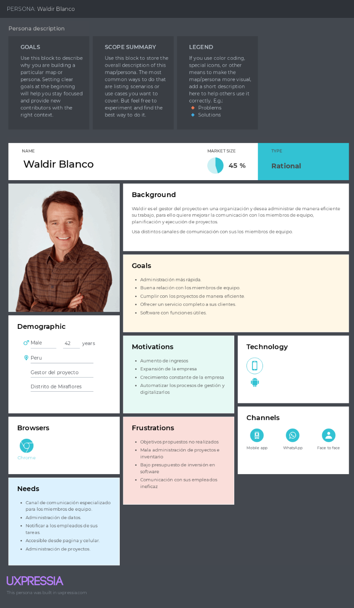
 

**Segmento 2:** 
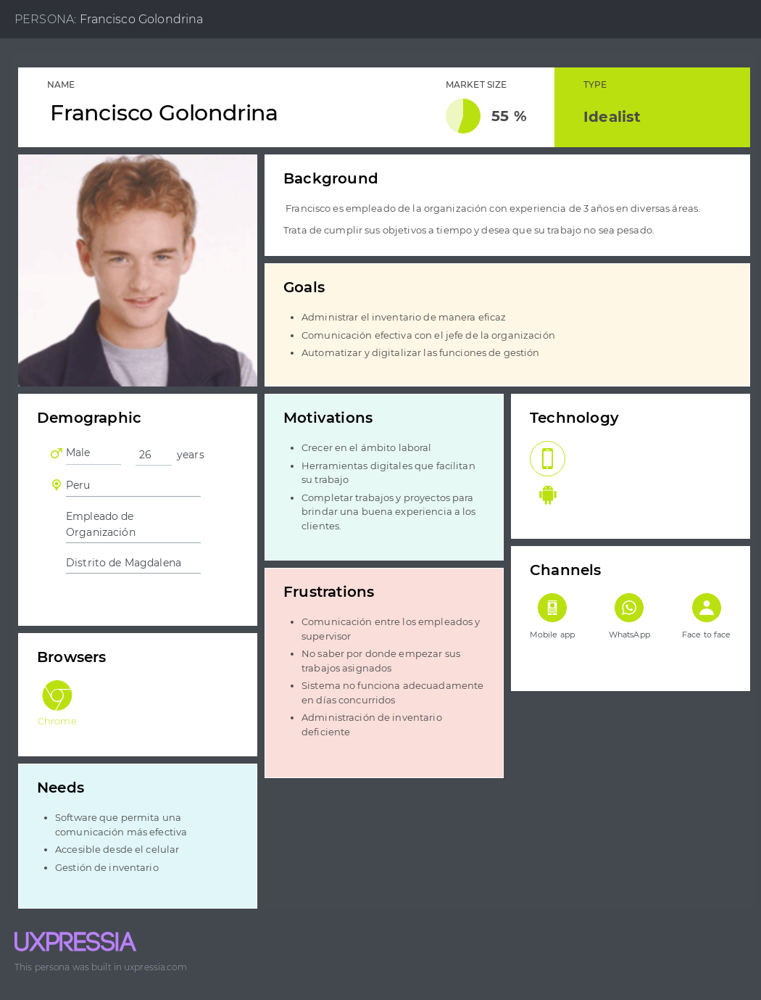
 

### 2.3.2. User Task Matrix
 
El User Task Matrix nos sirve para identificar los procesos que realizan ambos segmentos donde se pueden observar las similitudes respecto a la importancia y frecuencias de estos procesos. Esto es antes de implementar nuestra solución.
 
<table border="1" cellspacing="0" cellpadding="8" style="border-collapse: collapse; text-align: center;">
  <thead style="background-color: #3D4B66; color: white;">
    <tr>
      <th rowspan="2">Título</th>
      <th colspan="2">Segmento 1</th>
      <th colspan="2">Segmento 2</th>
    </tr>
    <tr>
      <th>Importancia</th>
      <th>Frecuencia</th>
      <th>Importancia</th>
      <th>Frecuencia</th>
    </tr>
  </thead>
  <tbody style="background-color: #1A2B3C; color: white;">
    <tr>
      <td>Comunicar al equipo de sus tareas en un proyecto.</td>
      <td style="background-color: #B26A00;">Alta</td>
      <td style="background-color: #665100;">Media</td>
      <td style="background-color: #B26A00;">Alta</td>
      <td style="background-color: #4D5F3C;">Baja</td>
    </tr>
    <tr>
      <td>Establecer fechas importantes o un cronograma orientado a las actividades a realizar.</td>
      <td style="background-color: #B26A00;">Alta</td>
      <td style="background-color: #665100;">Media</td>
      <td style="background-color: #665100;">Media</td>
      <td style="background-color: #4D5F3C;">Baja</td>
    </tr>
    <tr>
      <td>Evaluar los resultados del proyecto realizado.</td>
      <td style="background-color: #B26A00;">Alta</td>
      <td style="background-color: #665100;">Media</td>
      <td style="background-color: #665100;">Media</td>
      <td style="background-color: #4D5F3C;">Baja</td>
    </tr>
    <tr>
      <td>Registrar información del proyecto.</td>
      <td style="background-color: #B26A00;">Alta</td>
      <td style="background-color: #665100;">Media</td>
      <td style="background-color: #B26A00;">Alta</td>
      <td style="background-color: #B26A00;">Alta</td>
    </tr>
    <tr>
      <td>Planificar reuniones mensuales & anuales.</td>
      <td style="background-color: #B26A00;">Alta</td>
      <td style="background-color: #2F4F3E;">Baja</td>
      <td style="background-color: #665100;">Media</td>
      <td style="background-color: #4D5F3C;">Baja</td>
    </tr>
    <tr>
      <td>Registrar datos en Excel.</td>
      <td style="background-color: #B26A00;">Alta</td>
      <td style="background-color: #665100;">Media</td>
      <td style="background-color: #B26A00;">Alta</td>
      <td style="background-color: #4D5F3C;">Baja</td>
    </tr>
    <tr>
      <td>Supervisar proyecto en ejecución</td>
      <td style="background-color: #B26A00;">Alta</td>
      <td style="background-color: #665100;">Media</td>
      <td style="background-color: #B26A00;">Alta</td>
      <td style="background-color: #B26A00;">Alta</td>
    </tr>
  </tbody>
</table>

### 2.3.3. User Journey Mapping
El Journey Mapping es necesario para entender el proceso que recorren nuestros segmentos en un escenario común en su área laboral. De esta forma entendemos sus problemas, experiencias, ideas y oportunidades. 

**Segmento 1** 
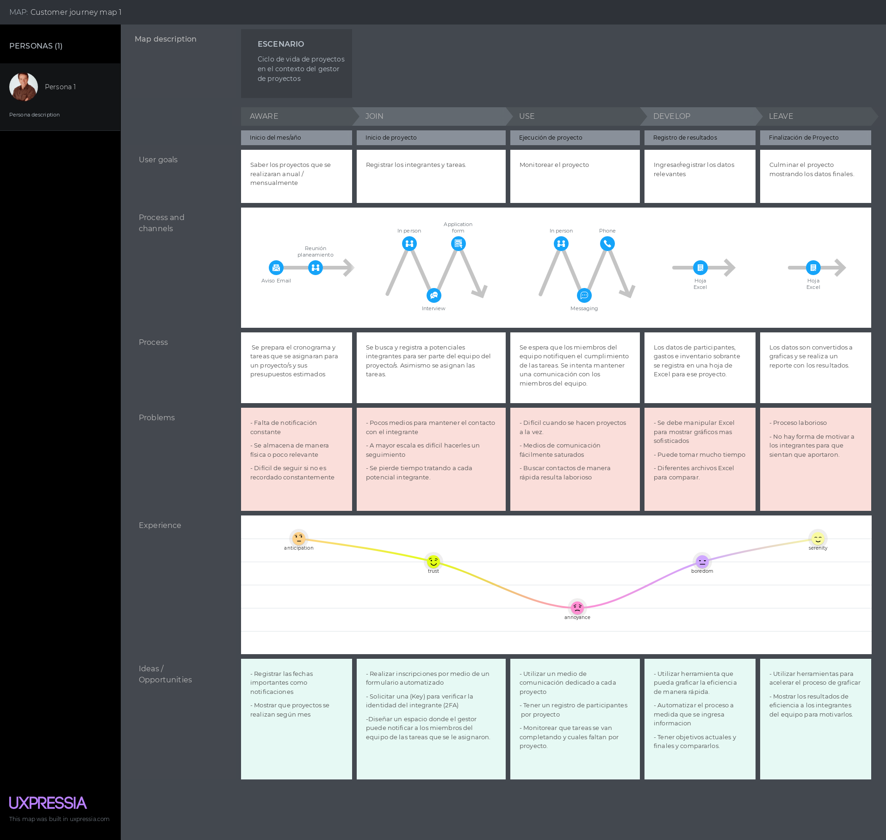
 
**Segmento 2** 
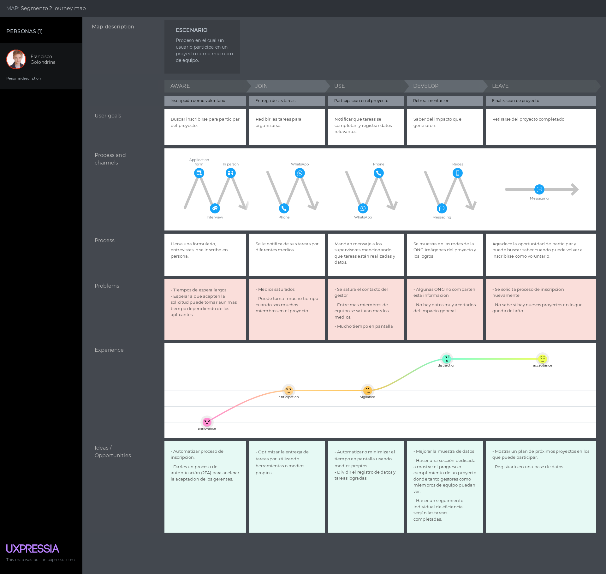
 
### 2.3.4. Empathy Mapping

**Segmento 1:** 

 
**Segmento 2:** 

 
### 2.3.5. As-is Scenario Mapping

 

**Enlace:** https://miro.com/welcomeonboard/NlNXV0pNbjkzNGhhN0RaVE1GZ2QxdEE0T1lxcExSSFRwOFFubkdVZlVMZ2Nuc0U2Z292TXVjZUFsZ3hlczJMWXwzNDU4NzY0NTIyNTI2OTE2NTk0fDI=?share_link_id=464993559168

## 2.4. Ubiquitous Language

# Capítulo III: Requirements Specifications

## 3.1. To-Be Scenario Mapping

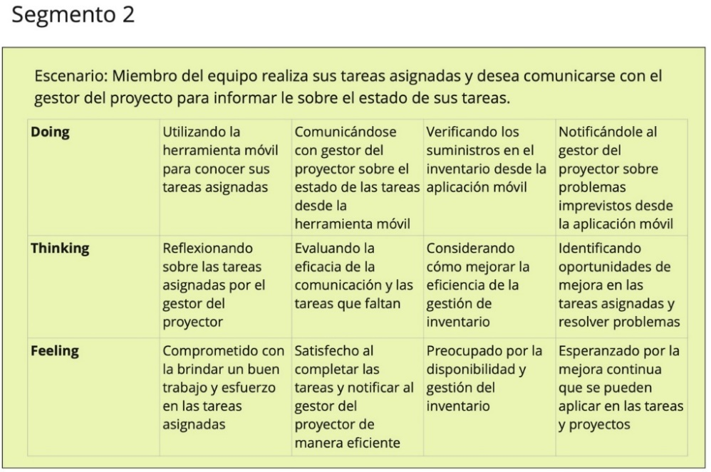
 
**Enlace:** https://miro.com/welcomeonboard/NlNXV0pNbjkzNGhhN0RaVE1GZ2QxdEE0T1lxcExSSFRwOFFubkdVZlVMZ2Nuc0U2Z292TXVjZUFsZ3hlczJMWXwzNDU4NzY0NTIyNTI2OTE2NTk0fDI=?share_link_id=464993559168  
## 3.2. User Stories
**Épicas:** 

<table border="1" cellspacing="0" cellpadding="8" style="border-collapse: collapse; text-align: center;">
  <thead style="background-color: #008000; color: white;">
    <tr>
      <th>EPX</th>
      <th>Título Épica</th>
      <th>HU asignadas</th>
    </tr>
  </thead>
  <tbody style="background-color: #006D8F; color: white;">
    <tr>
      <td>EP01</td>
      <td>Informar del producto y empresa</td>
      <td style="background-color: #8B4513;">HU01 – HU05</td>
    </tr>
    <tr>
      <td>EP02</td>
      <td>Gestionar Usuarios</td>
      <td style="background-color: #5A3A2E;">HU06 – HU10</td>
    </tr>
    <tr>
      <td>EP03</td>
      <td>Gestionar miembros de equipo</td>
      <td>HU11 – HU13</td>
    </tr>
    <tr>
      <td>EP04</td>
      <td>Gestionar Proyectos</td>
      <td style="background-color: #8B4513;">HU14 – HU16</td>
    </tr>
    <tr>
      <td>EP05</td>
      <td>Gestionar Tareas</td>
      <td style="background-color: #9370DB;">HU17 – HU21</td>
    </tr>
    <tr>
      <td>EP06</td>
      <td>Gestionar Fechas</td>
      <td style="background-color: #DA70D6;">HU22 – HU24</td>
    </tr>
    <tr>
      <td>EP07</td>
      <td>Gestionar la comunicación con el equipo</td>
      <td style="background-color: #2E8B57;">HU25 – HU28</td>
    </tr>
    <tr>
      <td>EP08</td>
      <td>Gestionar Análisis</td>
      <td>HU29 – HU31</td>
    </tr>
    <tr>
      <td>EP09</td>
      <td>Implementación de Seguridad</td>
      <td>HU32 – HU33</td>
    </tr>
  </tbody>
</table>

**Historias Usuario:** 
**Owner: AidManager** 
<table>
<colgroup>
<col style="width: 8%" />
<col style="width: 16%" />
<col style="width: 21%" />
<col style="width: 53%" />
</colgroup>
<thead>
<tr class="header">
<th>HUX</th>
<th>Historia de Usuario</th>
<th>
Descripción

(Escenario)
</th>
<th>Criterios de Aceptación (Dado que, Cuando, Entonces, Y)</th>
</tr>
</thead>
<tbody>
<tr class="odd">
<td rowspan="2">HU01</td>
<td rowspan="2">Ofrecer información de la empresa</td>
<td rowspan="2"><strong>Como</strong> visitante, <strong>quiero</strong>
conseguir información sobre la empresa <strong>para</strong> saber más
sobre su misión y visión.</td>
<td>
<strong>Caso A: El visitante encuentra información de la
empresa.</strong>

<strong>Given</strong> el visitante está en la página de
información,

<strong>When</strong> revisa la sección de la empresa,

<strong>Then</strong> debería ver detalles sobre la misión y visión
de la empresa.
</td>
</tr>
<tr class="even">
<td>
<strong>Caso A: El visitante recibe un error de cargar
datos.</strong>

<strong>Given</strong> el visitante está en la página de
información,

<strong>When</strong> no encuentra detalles sobre la empresa,

<strong>Then</strong> debería ver un mensaje de error indicando que
la información está temporalmente no disponible.
</td>
</tr>
<tr class="odd">
<td rowspan="2">HU02</td>
<td rowspan="2">Informar sobre los beneficios del producto</td>
<td rowspan="2"><strong>Como</strong> visitante, quiero conocer los
beneficios del producto para evaluar si cumple con mis necesidades.</td>
<td>
<strong>Caso A:</strong>

<strong>Given</strong> el visitante está en la sección de
beneficios,

<strong>When</strong> revisa la lista de beneficios,

<strong>Then</strong> debería ver una lista detallada de los
beneficios que ofrece el producto.
</td>
</tr>
<tr class="even">
<td>
<strong>Given</strong> el visitante está en la sección de
beneficios,

<strong>When</strong> no encuentra beneficios listados,

<strong>Then</strong> debería ver un mensaje de error indicando que
los beneficios no están disponibles.
</td>
</tr>
<tr class="odd">
<td rowspan="2">HU03</td>
<td rowspan="2">Conocer los testimonios de los clientes pasados</td>
<td rowspan="2"><strong>Como</strong> visitante, <strong>quiero</strong>
leer testimonios de clientes anteriores <strong>para</strong> saber si
han tenido experiencias positivas.</td>
<td>
<strong>Given</strong> el visitante está en la sección de
testimonios,

<strong>When</strong> revisa los comentarios y valoraciones,

<strong>Then</strong> debería ver comentarios y valoraciones de
clientes pasados.
</td>
</tr>
<tr class="even">
<td>
<strong>Given</strong> el visitante está en la sección de
testimonios,

<strong>When</strong> no encuentra testimonios,

<strong>Then</strong> debería ver un mensaje de error indicando que
los testimonios no están disponibles.
</td>
</tr>
<tr class="odd">
<td rowspan="2">HU04</td>
<td rowspan="2">Informarse sobre los diferentes planes de precio</td>
<td rowspan="2"><strong>Como</strong> visitante, <strong>quiero</strong>
ver los diferentes planes de precio <strong>para</strong> elegir el que
mejor se ajuste a mi presupuesto.</td>
<td>
<strong>Given</strong> el usuario está en la sección de
precios,

<strong>When</strong> revisa la comparación de planes,

<strong>Then</strong> debería ver una comparación clara de los
diferentes planes de precios disponibles.
</td>
</tr>
<tr class="even">
<td>
<strong>Given</strong> el usuario está en la sección de
precios,

<strong>When</strong> no encuentra información sobre los planes,

<strong>Then</strong> debería ver un mensaje de error indicando que
los precios no están disponibles.
</td>
</tr>
<tr class="odd">
<td rowspan="2">HU05</td>
<td rowspan="2">Contactar con la empresa</td>
<td rowspan="2"><strong>Como</strong> usuario, <strong>quiero</strong>
poder contactar con la empresa <strong>para</strong> resolver mis
dudas.</td>
<td>
<strong>Given</strong> el usuario está en la sección de
contactos,

<strong>When</strong> revisa las opciones de comunicación

<strong>Then</strong> debería ver opciones para contactar con la
empresa (teléfono, email, formulario de contacto).
</td>
</tr>
<tr class="even">
<td>
<strong>Given</strong> el usuario está en la sección de
contacto,

<strong>When</strong> no encuentra opciones de contacto,

<strong>Then</strong> debería ver un mensaje de error indicando que
los métodos de contacto no están disponibles.
</td>
</tr>
<tr class="odd">
<td rowspan="2">HU06</td>
<td rowspan="2">Mostrar información de perfiles de miembros de
equipo.</td>
<td rowspan="2"><strong>Como</strong> gestor, <strong>quiero</strong>
ver la información de los miembros de equipo <strong>para</strong>
realizar un monitoreo de identidad y tener información de contacto.</td>
<td>
<strong>Caso: Se ve la información del perfil 
Given</strong> el gestor está en la vista donde están los perfiles de
integrantes,

<strong>When</strong> selecciona un perfil,

<strong>Then</strong> aparece una información del miembro de equipo
incluyendo su nombre e información de contacto.
</td>
</tr>
<tr class="even">
<td>
<strong>Caso: No se ve la información del perfil</strong>

<strong>Given</strong> el gestor está en la vista donde están los
perfiles de integrantes,

<strong>When</strong> selecciona un perfil y no ve la información del
perfil

<strong>Then</strong> aparece un mensaje de error pidiendo que
recargue el perfil.
</td>
</tr>
<tr class="odd">
<td rowspan="2">HU07</td>
<td rowspan="2">Mostrar información de perfiles de gestores</td>
<td rowspan="2"><strong>Como</strong> miembro de equipo,
<strong>quiero</strong> conocer la información de los gestores de equipo
<strong>para</strong> saber más de mis superiores e información de
contacto.</td>
<td>
<strong>Caso: Se ve la información del perfil</strong>

<strong>Given</strong> el miembro de equipo está en la vista donde
están los perfiles de los integrantes de la ONG,

<strong>When</strong> selecciona un perfil,

<strong>Then</strong> ve una información del miembro de equipo
incluyendo la información de contacto y nombres.
</td>
</tr>
<tr class="even">
<td>
<strong>Caso: No se ve la información del perfil</strong>

<strong>Given</strong> el miembro del equipo está en la vista donde
está el perfil del gestor de la organización,

<strong>When</strong> selecciona un perfil y no ve la información del
perfil

<strong>Then</strong> sale un mensaje de error pidiendo que recargue
el perfil.
</td>
</tr>
<tr class="odd">
<td rowspan="2">HU08</td>
<td rowspan="2">Mostrar información de perfil de la ONG</td>
<td rowspan="2"><strong>Como</strong> usuario, <strong>quiero</strong>
conocer más de la organización de la cual participo
<strong>para</strong> informarme de la misión y visión de esta
misma.</td>
<td>
<strong>Caso: Se muestra la información de la ONG</strong>

<strong>Given</strong> el usuario se encuentra en el menú principal o
en la sección de proyectos,

<strong>When</strong> selecciona el botón con el nombre de la
organización,

<strong>Then</strong> ve la información correspondiente de la
organización.
</td>
</tr>
<tr class="even">
<td>
<strong>Caso: Se muestra la información de la ONG desde el
usuario gestor</strong>

<strong>Given</strong> el gestor se encuentra en el menú principal o
en la sección de proyectos,

<strong>When</strong> selecciona el botón con el nombre de la
organización,

<strong>Then</strong> ve la información correspondiente de la
organización y la opción de editar esta misma información.
</td>
</tr>
<tr class="odd">
<td rowspan="2">HU09</td>
<td rowspan="2">Editar información de perfil</td>
<td rowspan="2"><strong>Como</strong> usuario, <strong>quiero</strong>
poder editar mi perfil <strong>para</strong> actualizar mi información
de contacto o errores que haya realizado al registrarme.</td>
<td>
<strong>Caso: Usuario edita su perfil</strong>

<strong>Given</strong> usuario está en su perfil,

<strong>When</strong> presiona en los botones para editar perfil,

<strong>Then</strong> edita la información del perfil.
</td>
</tr>
<tr class="even">
<td>
<strong>Caso: Usuario falla en editar su perfil</strong>

<strong>Given</strong> usuario está en su perfil,

<strong>When</strong> presiona en los botones para editar perfil y no
pone la información requerida,

<strong>Then</strong> aparece un mensaje solicitando la información
solicitada.
</td>
</tr>
</tbody>
</table>

<table>
<colgroup>
<col style="width: 8%" />
<col style="width: 16%" />
<col style="width: 21%" />
<col style="width: 53%" />
</colgroup>
<thead>
<tr class="header">
<th rowspan="2">HU10</th>
<th rowspan="2">Autenticar usuarios por medio de código de
organización</th>
<th rowspan="2"><strong>Como</strong> gestor, <strong>quiero</strong>
invitar a un miembro de equipo usando un código de organización
<strong>para</strong> que este pueda registrarse a la organización.</th>
<th>
<strong>Caso: El miembro de equipo se registra
correctamente.</strong>

<strong>Given</strong> el gestor envía el código de invitación al
usuario miembro de equipo,

<strong>When</strong> ingresa el código al registrarse en la
aplicación, <strong>Then</strong> ingresa sin problema a la organización
del código.
</th>
</tr>
<tr class="odd">
<th>
<strong>Caso: El miembro de equipo ingresa un código
invalido.</strong>

<strong>Given</strong> el gestor no envía el código de invitación al
usuario miembro de equipo,

<strong>When</strong> no ingresa el código o ingresa el código
incorrecto al registrarse en la aplicación,

<strong>Then</strong> sale un error solicitando que ingrese un código
valido.
</th>
</tr>
</thead>
<tbody>
<tr class="odd">
<td rowspan="2">HU11</td>
<td rowspan="2">Mostrar lista de perfiles de miembros de equipo.</td>
<td rowspan="2"><strong>Como</strong> gestor, <strong>quiero</strong>
ver un listado de los miembros y sus contactos <strong>para</strong>
poder contactar fácilmente a los miembros del equipo.</td>
<td>
<strong>Caso: Se muestra la lista de usuarios</strong>

<strong>Given</strong> el gestor está en el panel de proyecto,

<strong>When</strong> va a la lista de miembros de equipo,

<strong>Then</strong> debería ver una lista de todos los miembros del
equipo y sus contactos.
</td>
</tr>
<tr class="even">
<td>
<strong>Caso: No se muestra la lista de usuarios</strong>

<strong>Given</strong> el gestor está en el panel de proyecto,

<strong>When</strong> no se muestra la lista de miembros de equipo,
<strong>Then</strong> aparece un mensaje de error.
</td>
</tr>
<tr class="odd">
<td rowspan="2">HU12</td>
<td rowspan="2">Contactar a los miembros del equipo por medio de
WhatsApp</td>
<td rowspan="2"><strong>Como</strong> usuario, <strong>quiero</strong>
conocer los contactos de mis compañeros <strong>para</strong> poder
mantener una comunicación.</td>
<td>
<strong>Caso: El link de WhatsApp direcciona a la
aplicación</strong>

<strong>Given</strong> el usuario está en la lista de miembros,

<strong>When</strong> presiona el botón de WhatsApp y acepte los
permisos para redireccionar a la aplicación,

<strong>Then</strong> se redirecciona a la aplicación de WhatsApp con
el número del perfil.
</td>
</tr>
<tr class="even">
<td>
<strong>Caso: El link de WhatsApp falla.</strong>

<strong>Given</strong> el usuario está en la lista de miembros,

<strong>When</strong> presiona el botón de WhatsApp y no acepta los
permisos para redireccionar a la aplicación,

<strong>Then</strong> sale un mensaje mencionando que debe aceptar
los permisos para redireccionar a aplicaciones.
</td>
</tr>
<tr class="odd">
<td rowspan="2">HU13</td>
<td rowspan="2">Eliminar Perfil de miembro de equipo</td>
<td rowspan="2"><strong>Como</strong> gestor, <strong>quiero</strong>
eliminar un perfil de miembro de equipo <strong>para</strong> liberar
espacio para nuevas cuentas o concluir la participación de un miembro de
equipo.</td>
<td>
<strong>Caso: El gestor elimina usuario de la
organización.</strong>

<strong>Given</strong> el gestor está en la lista de miembros,

<strong>When</strong> selecciona un perfil y le da al botón de
eliminar usuario y confirma esta acción, <strong>Then</strong> el
usuario es eliminado y se muestra un mensaje exitoso.
</td>
</tr>
<tr class="even">
<td>
<strong>Caso: El gestor falla en eliminar usuario de la
organización.</strong>

<strong>Given</strong> el gestor está en la lista de miembros,

<strong>When</strong> selecciona un perfil y le da al botón de
eliminar usuario, pero no confirma esta acción,

<strong>Then</strong> el usuario no es eliminado y se muestra un
mensaje exitoso.
</td>
</tr>
<tr class="odd">
<td rowspan="2">HU14</td>
<td rowspan="2">Visualizar de listado de proyectos</td>
<td rowspan="2"><strong>Como</strong> usuario, <strong>quiero</strong>
ver el listado de proyectos de mi interés <strong>para</strong> evaluar
la información relacionada.</td>
<td>
<strong>Caso: Se carga el listado de proyectos</strong>

<strong>Given</strong> el usuario está en la sección de
proyectos,

<strong>When</strong> la sección carga correctamente,

<strong>Then</strong> se debe de mostrar un listado de los proyectos
en relación con el usuario.
</td>
</tr>
<tr class="even">
<td>
<strong>Caso: Ocurre un error al cargar los datos</strong>

<strong>Given</strong> el usuario está en la sección de
proyectos,

<strong>When</strong> la sección carga demora demasiado,

<strong>Then</strong> se muestra un mensaje de error para
recargar.
</td>
</tr>
<tr class="odd">
<td rowspan="2">HU15</td>
<td rowspan="2">Ingresar nuevo proyecto</td>
<td rowspan="2"><strong>Como</strong> gestor, <strong>quiero</strong>
ingresar un nuevo proyecto <strong>para</strong> hacerle su seguimiento
administrativo.</td>
<td>
<strong>Caso: Se ingresa la información requerida</strong>

<strong>Given</strong> el gestor se encuentra en la vista de
proyectos,

<strong>When</strong> presiona el botón para agregar un proyecto y
agrega el título, descripción, ubicación e imágenes de referencia,

<strong>Then</strong> se muestra un mensaje de proyecto agregado y se
actualiza la lista de proyectos con el más reciente primero.
</td>
</tr>
<tr class="even">
<td>
<strong>Caso: No se ingresa la información requerida</strong>

<strong>Given</strong> el gestor se encuentra en la vista de
proyectos,

<strong>When</strong> presiona el botón para agregar un proyecto le
falta agregar información importante como el título o imágenes de
referencia,

<strong>Then</strong> se muestra un error en el dialogo solicitando
que se ingrese la información requerida para agregar un
proyecto.
</td>
</tr>
<tr class="odd">
<td rowspan="2">HU16</td>
<td rowspan="2">Editar información de proyecto</td>
<td rowspan="2"><strong>Como</strong> gestor, <strong>quiero</strong>
editar la información del proyecto <strong>para</strong> actualizar
cambios como ubicación o descripción.</td>
<td>
<strong>Caso: Se edita la información del proyecto</strong>

<strong>Given</strong> gestor está en la sección de proyecto,
<strong>When</strong> presione el botón de editar y cambie la
información que desea editar,

<strong>Then</strong> se actualiza la información del
proyecto.
</td>
</tr>
<tr class="even">
<td>
<strong>Caso: Ocurre un error al actualizar la información del
proyecto</strong>

<strong>Given</strong> gestor está en la sección de proyecto,
<strong>When</strong> presione el botón de editar y cambie la
información que desea editar, pero ingrese datos erróneos o no
válidos,

<strong>Then</strong> se muestra un mensaje de error explicando que
salió mal.
</td>
</tr>
<tr class="odd">
<td rowspan="2">HU17</td>
<td rowspan="2">Visualizar tareas</td>
<td rowspan="2"><strong>Como</strong> gestor, <strong>quiero</strong>
ver las tareas del proyecto <strong>para</strong> evaluar los pendientes
relacionados a las tareas.</td>
<td>
<strong>Caso: Se muestran las tareas correctamente.</strong>

<strong>Given</strong> el gestor está en la sección de proyecto,

<strong>When</strong> presiona el botón de ver tareas y se redirige a
esa sección,

<strong>Then</strong> se observa las tareas To-Do, Doing y
Done.
</td>
</tr>
<tr class="even">
<td>
<strong>Caso: No se muestran tareas</strong>

<strong>Given</strong> el gestor está en la sección de proyecto,

<strong>When</strong> presiona el botón de ver tareas y se redirige a
esa sección y no tiene tareas agregadas,

<strong>Then</strong> observa un mensaje que le solicite agregar
tareas para empezar.
</td>
</tr>
<tr class="odd">
<td rowspan="2">HU18</td>
<td rowspan="2">Crear tarea</td>
<td rowspan="2"><strong>Como</strong> gestor, <strong>quiero</strong>
crear tareas <strong>para</strong> organizar a mi equipo.</td>
<td>
<strong>Caso: Se agrega la tarea correctamente.</strong>

<strong>Given</strong> el gestor está en la sección de tareas,

<strong>When</strong> presiona el botón de agregar tarea e ingresa el
título, descripción, fecha de expiración, el estado de la tarea y a
quien está asignada la tarea.

<strong>Then</strong> Se agrega la tarea según la columna que le
corresponde
</td>
</tr>
<tr class="even">
<td>
<strong>Caso: Faltan datos en la tarea.</strong>

<strong>Given</strong> el gestor está en la sección de tareas,

<strong>When</strong> presiona el botón de agregar tarea y le falta
ingresar el título, descripción, fecha de expiración, el estado de la
tarea o a quien está asignada la tarea.

<strong>Then</strong> se muestra un mensaje solicitando que llene los
campos faltantes con la información valida.
</td>
</tr>
<tr class="odd">
<td rowspan="2">HU19</td>
<td rowspan="2">Editar tarea</td>
<td rowspan="2"><strong>Como</strong> gestor, <strong>quiero</strong>
editar alguna tarea <strong>para</strong> aumentar la fecha de
expiración o cambiar al miembro de equipo asignado</td>
<td>
<strong>Caso: Se edita la tarea correctamente</strong>

<strong>Given</strong> el gestor está en la sección de tareas,

<strong>When</strong> presiona el botón de editar tarea y cambia el
ingresa la fecha de expiración, el estado de la tarea o a quien está
asignada la tarea.

<strong>Then</strong> se muestra un mensaje confirmando que se
actualizo la tarea y se actualiza la columna donde está.
</td>
</tr>
<tr class="even">
<td>
<strong>Caso: No se edita la tarea correctamente</strong>

<strong>Given</strong> el gestor está en la sección de tareas,

<strong>When</strong> presiona el botón de editar tarea y cambia el
ingresa la fecha de expiración, el estado de la tarea o a quien está
asignada la tarea con un dato erróneo.

<strong>Then</strong> se muestra un mensaje solicitando que se
ingrese información valida o mostrando el error.
</td>
</tr>
<tr class="odd">
<td rowspan="2">HU20</td>
<td rowspan="2">Cambio de estado de tarea</td>
<td rowspan="2"><strong>Como</strong> miembro de equipo,
<strong>quiero</strong> cambiar el estado de mi tarea
<strong>para</strong> dar a saber cómo va mi progreso.</td>
<td>
<strong>Caso: Se cambia el estado de una tarea</strong>

<strong>Given</strong> el miembro de equipo está en la sección de
tareas después de estar en la sección de proyecto,

<strong>When</strong> presiona el botón para cambiar el estado de su
tarea,

<strong>Then</strong> la tarea debería cambiar de columna y
actualizar su estado.
</td>
</tr>
<tr class="even">
<td>
<strong>Caso: Sucede un error al cambiar el estado de una
tarea</strong>

<strong>Given</strong> el miembro de equipo está en la sección de
tareas después de estar en la sección de proyecto,

<strong>When</strong> presiona el botón para cambiar el estado de su
tarea, pero esta no cambia,

<strong>Then</strong> se muestra un mensaje solicitando que vuelva a
intentarlo.
</td>
</tr>
</tbody>
</table>

<table>
<colgroup>
<col style="width: 8%" />
<col style="width: 16%" />
<col style="width: 21%" />
<col style="width: 53%" />
</colgroup>
<thead>
<tr class="header">
<th rowspan="2">HU21</th>
<th rowspan="2">Eliminar una tarea</th>
<th rowspan="2"><strong>Como</strong> gestor, <strong>quiero</strong>
eliminar una tarea <strong>para</strong> quitar una tarea que no
correspondía con el proyecto.</th>
<th>
<strong>Caso: Se borra la tarea exitosamente</strong>

<strong>Given</strong> el gestor está en la sección de tareas,

<strong>When</strong> presiona el botón de eliminar tareas y confirma
su acción,

<strong>Then</strong> se quita la tarea de la columna.
</th>
</tr>
<tr class="odd">
<th>
<strong>Caso: Ocurre un error al borrar la tarea</strong>

<strong>Given</strong> el gestor está en la sección de tareas,

<strong>When</strong> presiona el botón de eliminar tareas y confirma
su acción, pero sucede un error al eliminar la tarea,

<strong>Then</strong> se muestra un mensaje mencionando que ocurrió
un error y que intente de nuevo.
</th>
</tr>
</thead>
<tbody>
<tr class="odd">
<td rowspan="2">HU22</td>
<td rowspan="2">Visualizar de fechas vinculadas con las tareas y
proyectos</td>
<td rowspan="2"><strong>Como</strong> usuario, <strong>quiero</strong>
revisar las fechas correspondientes de las tareas y proyectos
<strong>para</strong> asegurarme que se cumplan a tiempo y organizar
tiempos.</td>
<td>
<strong>Caso: Se vinculan las tareas con fechas
correctamente</strong>

<strong>Given</strong> el usuario se encuentra en la sección
calendario,

<strong>When</strong> carga el calendario en el formato que desee el
usuario,

<strong>Then</strong> se muestran las tareas y proyectos según su
fecha de expiración.
</td>
</tr>
<tr class="even">
<td>
<strong>Caso: No aparecen las fechas</strong>

<strong>Given</strong> el usuario se encuentra en la sección
calendario,

<strong>When</strong> no observa el calendario con las fechas,

<strong>Then</strong> se muestra un mensaje solicitando que se
recargue.
</td>
</tr>
<tr class="odd">
<td rowspan="2">HU23</td>
<td rowspan="2">Agregar una fecha relacionada a tarea</td>
<td rowspan="2"><strong>Como</strong> gestor, <strong>quiero</strong>
agregar una fecha importante <strong>para</strong> organizar los tiempos
del equipo.</td>
<td>
<strong>Caso: Se ingresa una fecha</strong>

<strong>Given</strong> el gestor está en la sección de
calendario,

<strong>When</strong> ingresa los datos como nombre, fecha y
descripción,

<strong>Then</strong> se agrega en la fecha seleccionada la fecha
importante.
</td>
</tr>
<tr class="even">
<td>
<strong>Caso: Se ingresan datos inválidos</strong>

<strong>Given</strong> el gestor está en la sección de
calendario,

<strong>When</strong> ingresa datos inválidos para el nombre, fecha y
descripción,

<strong>Then</strong> se muestra un mensaje mencionando que los datos
son inválidos.
</td>
</tr>
<tr class="odd">
<td rowspan="2">HU24</td>
<td rowspan="2">Editar o Eliminar una fecha en especifico</td>
<td rowspan="2"><strong>Como</strong> gestor, <strong>quiero</strong>
editar o eliminar una fecha <strong>para</strong> evitar un error o
cambiar la fecha que ingrese previamente.</td>
<td>
<strong>Caso: Se realiza una operación con el
calendario</strong>

<strong>Given</strong> el gestor está en la sección de
calendario,

<strong>When</strong> presiona el botón de editar e ingresa los datos
o presiona el botón de eliminar,

<strong>Then</strong> los cambios se realizan según la operación y se
actualiza el calendario.
</td>
</tr>
<tr class="even">
<td>
<strong>Caso: Realizar una operación de calendario
falla.</strong>

<strong>Given</strong> el gestor está en la sección de
calendario,

<strong>When</strong> presiona el botón de editar e ingresa los datos
o presiona el botón de eliminar y sucede un error al realizar la
operación,

<strong>Then</strong> se muestra un mensaje informando del error y
solicitando que intente de nuevo.
</td>
</tr>
<tr class="odd">
<td rowspan="2">HU25</td>
<td rowspan="2">Visualizar “Posts” de la comunidad</td>
<td rowspan="2"><strong>Como</strong> usuario, <strong>quiero</strong>
saber de la comunidad de la organización <strong>para</strong> saber de
los progresos de mis colegas e inspirarme en el cambio que se está
generando.</td>
<td>
<strong>Caso: Se muestra un listado de posts.</strong>

<strong>Given</strong> el usuario está la sección de comunidad,
<strong>When</strong> carga esta sección,

<strong>Then</strong> se muestran los posts de la
organización.
</td>
</tr>
<tr class="even">
<td>
<strong>Caso: Ocurre un error al mostrar el listado de
posts.</strong>

<strong>Given</strong> el usuario está la sección de comunidad,
<strong>When</strong> no carga esta sección,

<strong>Then</strong> se solicita recargar por medio de un
mensaje.
</td>
</tr>
<tr class="odd">
<td rowspan="2">HU26</td>
<td rowspan="2">Postear un post</td>
<td rowspan="2"><strong>Como</strong> gestor, <strong>quiero</strong>
agregar un post <strong>para</strong> mostrar a los integrantes de la
organización el progreso que se está logrando.</td>
<td>
<strong>Caso: Se crea un post</strong>

<strong>Given</strong> el gestor está en la sección de comunidad,

<strong>When</strong> presiona el botón de agregar post e ingresa la
información como título, descripción e imagen referencial,

<strong>Then</strong> el post es agregado a la lista de posts y se
muestra un mensaje confirmando la publicación.
</td>
</tr>
<tr class="even">
<td>
<strong>Caso: Falla la creación un post</strong>

<strong>Given</strong> el gestor está en la sección de comunidad,

<strong>When</strong> presiona el botón de agregar post e ingresa
incorrectamente la información como título, descripción o imagen
referencial,

<strong>Then</strong> se muestra un mensaje de error solicitando que
se ingresen bien los datos.
</td>
</tr>
<tr class="odd">
<td rowspan="2">HU27</td>
<td rowspan="2">Comentar o Reseñar un post</td>
<td rowspan="2"><strong>Como</strong> miembro de equipo,
<strong>quiero</strong> dar mi opinión y reseñar un post
<strong>para</strong> compartir con mis colegas lo que pienso e
interactuar con la comunidad.</td>
<td>
<strong>Caso: se realiza un comentario y reseña a un
post</strong>

<strong>Given</strong> el miembro de equipo está en la sección de
comunidad,

<strong>When</strong> ingresa su reseña y comentario,

<strong>Then</strong> aparece el comentario en la sección de
comentarios del post.
</td>
</tr>
<tr class="even">
<td>
<strong>Caso: falla en realizarse un comentario y reseña a un
post</strong>

<strong>Given</strong> el miembro de equipo está en la sección de
comunidad,

<strong>When</strong> ingresa su reseña y comentario y este no
carga,

<strong>Then</strong> se muestra un mensaje de error solicitando que
reintente comentar.
</td>
</tr>
<tr class="odd">
<td rowspan="2">HU28</td>
<td rowspan="2">Eliminar un post</td>
<td rowspan="2"><strong>Como</strong> gestor, <strong>quiero</strong>
eliminar un post <strong>para</strong> corregir algún post erróneo.</td>
<td>
<strong>Caso: Se elimina un post</strong>

<strong>Given</strong> el gestor está en la sección de comunidad,

<strong>When</strong> presiona el botón de eliminar post y se
confirma esta operación.

<strong>Then</strong> se muestra un mensaje confirmando la
eliminación del post.
</td>
</tr>
<tr class="even">
<td>
<strong>Caso: Falla la eliminación un post</strong>

<strong>Given</strong> el gestor está en la sección de comunidad,

<strong>When</strong> presiona el botón de eliminar post y tarda en
procesarse la operación,

<strong>Then</strong> se muestra un mensaje de error pidiendo que
intente de nuevo.
</td>
</tr>
</tbody>
</table>

<table>
<colgroup>
<col style="width: 8%" />
<col style="width: 16%" />
<col style="width: 21%" />
<col style="width: 53%" />
</colgroup>
<thead>
<tr class="header">
<th rowspan="2">HU29</th>
<th rowspan="2">Visualizar las estadísticas del proyecto</th>
<th rowspan="2"><strong>Como</strong> gestor, <strong>quiero</strong>
observar las analíticas del proyecto <strong>para</strong> evaluar
tendencias y revisar el progreso.</th>
<th>
<strong>Caso: Se cargan los gráficos correctamente</strong>

<strong>Given</strong> el gestor está en la sección de métricas,

<strong>When</strong> cargan los gráficos,

<strong>Then</strong> se muestran los gráficos de tareas completadas
y análisis de presupuesto.
</th>
</tr>
<tr class="odd">
<th>
<strong>Caso: No cargan los gráficos correctamente</strong>

<strong>Given</strong> el gestor está en la sección de métricas,

<strong>When</strong> no cargan los gráficos como se debería,

<strong>Then</strong> se muestra un mensaje de error solicitando que
se recargue la sección.
</th>
</tr>
</thead>
<tbody>
<tr class="odd">
<td rowspan="2">HU30</td>
<td rowspan="2">Agregar datos de presupuesto</td>
<td rowspan="2"><strong>Como</strong> gestor, <strong>quiero</strong>
gestionar las prioridades de las tareas <strong>para</strong> asegurar
que las tareas más importantes se completen primero.</td>
<td>
<strong>Given</strong> el gestor está en la sección de
prioridades,

<strong>When</strong> establece prioridades para las tareas,

<strong>Then</strong> debería ver las tareas organizadas según las
prioridades establecidas.
</td>
</tr>
<tr class="even">
<td>
<strong>Given</strong> el gestor está en la sección de
prioridades,

<strong>When</strong> no puede gestionar prioridades,

<strong>Then</strong> debería ver un mensaje de error indicando que
la gestión de prioridades no está funcionando.
</td>
</tr>
<tr class="odd">
<td rowspan="2">HU31</td>
<td rowspan="2">Editar datos de presupuesto</td>
<td rowspan="2"><strong>Como</strong> gestor, <strong>quiero</strong>
revisar el estado de las tareas <strong>para</strong> asegurarse de que
todas las tareas se están completando según lo planeado.</td>
<td>
<strong>Given</strong> el gestor está en la sección de estado de
tareas,

<strong>When</strong> revisa el estado de las tareas,

<strong>Then</strong> debería ver el estado actual de todas las
tareas (completadas, en progreso, pendientes).
</td>
</tr>
<tr class="even">
<td>
<strong>Given</strong> el gestor está en la sección de estado de
tareas,

<strong>When</strong> no puede ver el estado de las tareas,

<strong>Then</strong> debería ver un mensaje de error indicando que
la información del estado de tareas no está disponible.
</td>
</tr>
<tr class="odd">
<td rowspan="2">HU32</td>
<td rowspan="2">Implementar encriptación de contraseñas y código de
organización</td>
<td rowspan="2"><strong>Como</strong> desarrollador,
<strong>quiero</strong> asegurar las contraseñas y códigos
<strong>para</strong> salvaguardar los datos relevantes de mis usuarios
y mantener confidencialidad.</td>
<td>
<strong>Caso: La encriptación es realizada</strong>

<strong>Given</strong> el desarrollador utiliza algoritmos de
encriptación

<strong>When</strong> se ingresa una contraseña al api de la
aplicación,

<strong>Then</strong> se guarda en la base de datos de manera
encriptada.
</td>
</tr>
<tr class="even">
<td>
<strong>Caso: Falla el proceso de encriptación</strong>

<strong>Given</strong> el desarrollador utiliza algoritmos de
encriptación

<strong>When</strong> se ingresa una contraseña al api de la
aplicación y falla el proceso de encriptación,

<strong>Then</strong> se registra la anomalía y se devuelve un
error.
</td>
</tr>
</tbody>
</table>

<table>
<colgroup>
<col style="width: 8%" />
<col style="width: 16%" />
<col style="width: 21%" />
<col style="width: 53%" />
</colgroup>
<thead>
<tr class="header">
<th rowspan="2">HU33</th>
<th rowspan="2">Verificar que el código de organización sea
correcto</th>
<th rowspan="2"><strong>Como</strong> desarrollador,
<strong>quiero</strong> mantener la integridad del código de
organización <strong>para</strong> validar el código de
organización.</th>
<th>
<strong>Caso: La validación es realizada
correctamente</strong>

<strong>Given</strong> el desarrollador utiliza algoritmos de
validación

<strong>When</strong> se ingresa un código de organización al api de
la aplicación y es válido,

<strong>Then</strong> se guarda en la base de datos de manera
encriptada.
</th>
</tr>
<tr class="odd">
<th>
<strong>Caso: La validación es realizada
incorrectamente</strong>

<strong>Given</strong> el desarrollador utiliza algoritmos de
validación

<strong>When</strong> se ingresa un código de organización al api de
la aplicación y no es válido,

<strong>Then</strong> se devuelve un error con el mensaje de código
invalido.
</th>
</tr>
</thead>
<tbody>
</tbody>
</table>

## 3.3. Product Backlog
Se consideran las historias de usuario más importantes para el product backlog
Asimismo, se ha realizado un Trello para hacer seguimiento de nuestras tareas.
<table border="1">
  <thead>
    <tr>
      <th>Historia de Usuario</th>
      <th>Descripción</th>
      <th>Prioridad</th>
      <th>Story Points (1/2/3/5/8)</th>
    </tr>
  </thead>
  <tbody>
    <tr><td>HU01</td><td>Ofrecer información de la empresa</td><td>Alta</td><td>3</td></tr>
    <tr><td>HU02</td><td>Informar sobre los beneficios del producto</td><td>Alta</td><td>3</td></tr>
    <tr><td>HU03</td><td>Conocer los testimonios de los clientes pasados</td><td>Media</td><td>3</td></tr>
    <tr><td>HU05</td><td>Contactar con la empresa</td><td>Alta</td><td>2</td></tr>
    <tr><td>HU06</td><td>Mostrar información de perfiles de miembros de equipo</td><td>Media</td><td>2</td></tr>
    <tr><td>HU07</td><td>Mostrar información de perfiles de gestores</td><td>Alta</td><td>3</td></tr>
    <tr><td>HU08</td><td>Mostrar información de perfil de la ONG</td><td>Alta</td><td>3</td></tr>
    <tr><td>HU09</td><td>Editar información de perfil</td><td>Media</td><td>2</td></tr>
    <tr><td>HU10</td><td>Autenticar usuarios por medio de código de organización</td><td>Alta</td><td>3</td></tr>
    <tr><td>HU11</td><td>Mostrar lista de perfiles de miembros de equipo</td><td>Alta</td><td>3</td></tr>
    <tr><td>HU12</td><td>Contactar a los miembros del equipo por medio de WhatsApp</td><td>Media</td><td>2</td></tr>
    <tr><td>HU13</td><td>Eliminar Perfil de miembro de equipo</td><td>Media</td><td>3</td></tr>
    <tr><td>HU14</td><td>Visualizar de listado de proyectos</td><td>Alta</td><td>3</td></tr>
    <tr><td>HU15</td><td>Ingresar nuevo proyecto</td><td>Alta</td><td>3</td></tr>
    <tr><td>HU16</td><td>Editar información de proyecto</td><td>Alta</td><td>3</td></tr>
    <tr><td>HU17</td><td>Visualizar tareas</td><td>Media</td><td>2</td></tr>
    <tr><td>HU18</td><td>Crear tarea</td><td>Media</td><td>2</td></tr>
    <tr><td>HU19</td><td>Editar tarea</td><td>Alta</td><td>3</td></tr>
    <tr><td>HU20</td><td>Cambio de estado de tarea</td><td>Alta</td><td>3</td></tr>
    <tr><td>HU21</td><td>Eliminar una tarea</td><td>Alta</td><td>3</td></tr>
    <tr><td>HU22</td><td>Visualizar de fechas vinculadas con las tareas y proyectos</td><td>Alta</td><td>3</td></tr>
    <tr><td>HU23</td><td>Agregar una fecha importante</td><td>Media</td><td>2</td></tr>
    <tr><td>HU24</td><td>Editar o Eliminar una fecha en específico</td><td>Alta</td><td>3</td></tr>
    <tr><td>HU25</td><td>Visualizar “Posts” de la comunidad</td><td>Media</td><td>2</td></tr>
    <tr><td>HU26</td><td>Postear un post</td><td>Media</td><td>3</td></tr>
    <tr><td>HU27</td><td>Comentar o Reseñar un post</td><td>Alta</td><td>3</td></tr>
    <tr><td>HU28</td><td>Eliminar un post</td><td>Alta</td><td>3</td></tr>
    <tr><td>HU29</td><td>Visualizar las estadísticas del proyecto</td><td>Alta</td><td>3</td></tr>
    <tr><td>HU30</td><td>Agregar datos de presupuesto</td><td>Media</td><td>2</td></tr>
    <tr><td>HU31</td><td>Editar datos de presupuesto</td><td>Media</td><td>2</td></tr>
    <tr><td>HU32</td><td>Implementar encriptación de contraseñas y código de organización</td><td>Media</td><td>3</td></tr>
    <tr><td>HU33</td><td>Verificar que el código de organización sea correcto</td><td>Alta</td><td>3</td></tr>
  </tbody>
</table>
 
**Link:** https://trello.com/invite/b/66c568966561935d142481d8/ATTI5751dc000e3f7d636dff7058d697c8dd6B2D7184/aidmanagermobile  

## 3.4. Impact Mapping

Esta sección está dedicada a los mapas de impacto de nuestros segmentos objetivos.
**Segmento 1:** 
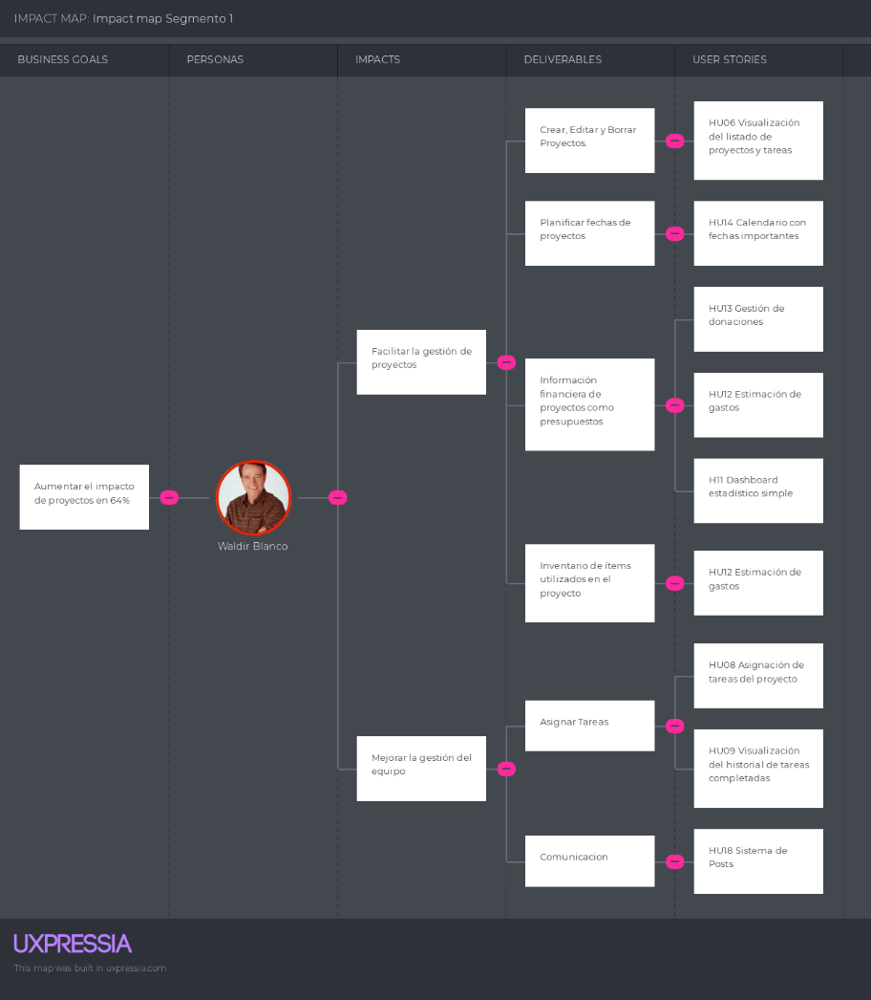
 
**Segmento 2:** 
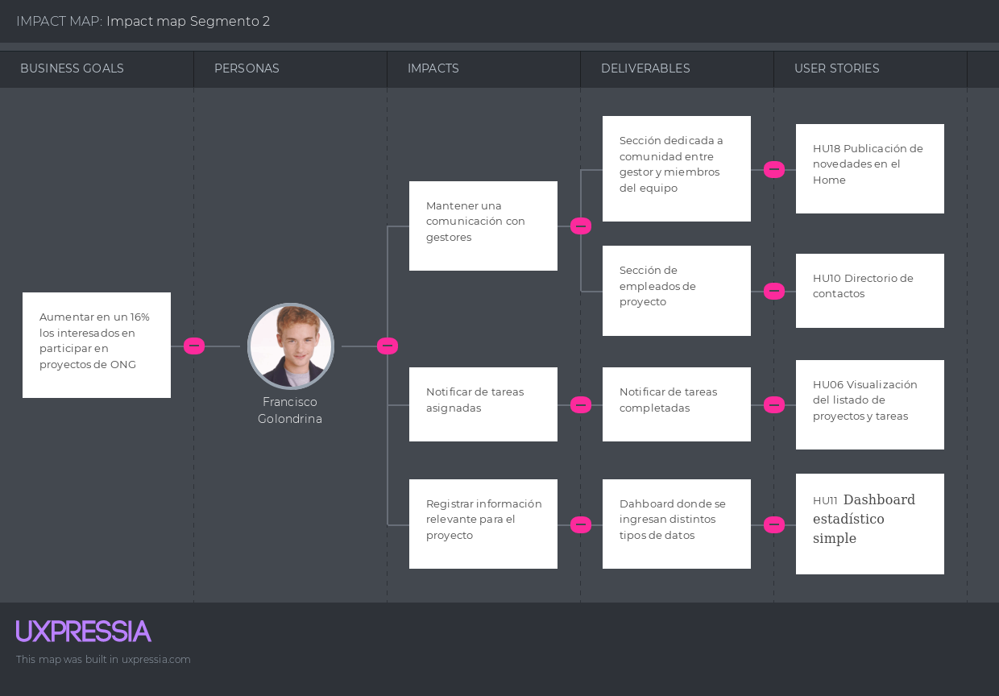

# Capítulo IV: Product Design

## 4.1.	Style Guidelines
Como startup, nos esforzamos por transmitir profesionalismo y eficiencia a través de nuestra aplicación web, AidManager. Hemos seleccionado una paleta de colores con tonos celestes y verdes para reflejar frescura y conexión con la naturaleza, mientras que las tipografías Poppins y Lora ofrecen una apariencia moderna, limpia y legible. Estas decisiones de diseño no solo buscan captar la atención de nuestros usuarios, sino también garantizar una experiencia agradable y efectiva, reforzando nuestro compromiso en la gestión eficiente de eventos benéficos y donaciones.

### 4.1.1.	General Style Guidelines
**Color Primario** 

Representa confianza, serenidad y estabilidad. Transmite la idea de fiabilidad y compromiso en la gestión de organizaciones benéficas, lo que inspira confianza en los donantes y en aquellos que buscan ayuda. 

 

**Color Secundario** 
Este color evoca calma, frescura y bienestar. Simboliza la esperanza y el apoyo el startup ofrece a las personas necesitadas, así como la naturaleza refrescante de las soluciones que proporciona. 
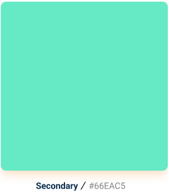
 

**Paleta de colores:** 

### 4.1.2.	Web Style Guidelines

### 4.1.3.	Mobile Style Guidelines

### 4.1.3.	Mobile Style Guidelines

#### 4.1.3.1.	iOS Mobile Style Guidelines

#### 4.1.3.2.	Android Mobile Style Guidelines

## 4.2.	Information Architecture
Esta sección está dedicada a cómo vamos a organizar la navegación en nuestra aplicación móvil.
### 4.2.1.	Organization System
Sistemas de organización que usaremos para el proyecto. 
El sistema de Organización se basa en un sistema secuencial donde el usuario debe seguir el workflow de la herramienta para llegar a su objetivo, no obstante, ofrecemos atajos para llegar a estos más rápido. 
Asimismo, existirá una jerarquía visual dependiendo si quien se ha ingresado es un gestor o un miembro de equipo.
### 4.2.2.	Labelling System
Los labels se usan para representar muchos datos en pocas palabras para este proyecto decidimos que nuestros labels principales son Home, Projects, Community y Profile. De esta manera será fácil de reconocer y entender.

### 4.2.3.	SEO and Meta Tags
Meta & SEO (Search Engine Optimization) Tags: sirven para que la página web donde promocionamos la aplicación sea encontrada fácilmente es lo que sale al encontrar la página en el buscador (se ponen en el <"head"> de la landing page o en la página store)
Título: <title> AidManager | La mejor opción de ONG para la gestión de proyectos </title>
Descripción: <meta name = "description" content = "Gestiona, Recolecta, Analiza y Visualiza los datos y colaboradores de tus proyectos todo en un solo lugar."/>
Palabras Clave: <meta name = "keyword" content = "ONG gestión, Gestionar Proyecto, ONG, dar Tareas, análisis de datos, Organizar, Orden "/>
### 4.2.4.	Searching Systems
**¿Que se busca?:** El usuario busca su proyecto para gestionar. **¿Qué resultados se mostrarán?:** Se debe de mostrar cards y entre ellas el proyecto que está revisando. 

**Interfaz de búsqueda:** El dashboard muestra en el sidebar las secciones una vez se selecciona la sección de proyectos se mostrarán las cards con sus proyectos, el usuario selecciona el proyecto específico y se hacen las redirecciones a su proyecto para gestionar específicas.

### 4.2.5.	Navigation Systems
La navegación de la Mobile App se estará basando en un Sistema de navegación Global donde por medio de las cards en el dashboard o los labels en el side-bar e incluso el bottom-nav. el usuario se redirija a la sección seleccionada. Asimismo, se usa la navegación local para ver información dedicada a las secciones.
## 4.3.	Landing Page UI Design
Esta sección está orientada a mostrar el diseño de nuestra landing page la cual es necesaria para presentarnos y promover nuestro producto a los usuarios.
### 4.3.1.	Landing Page Wireframe

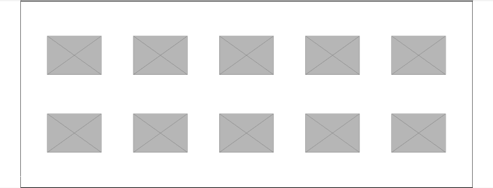

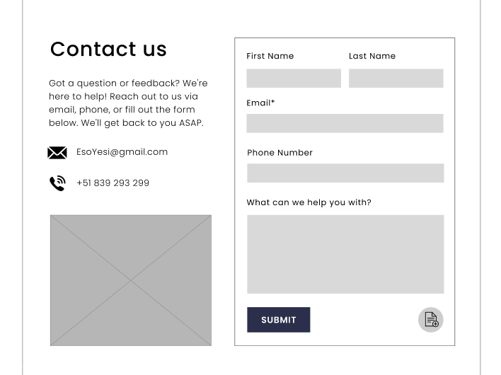
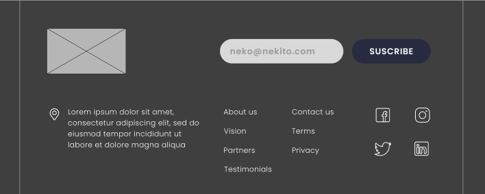

### 4.3.2.	Landing Page Mock-up

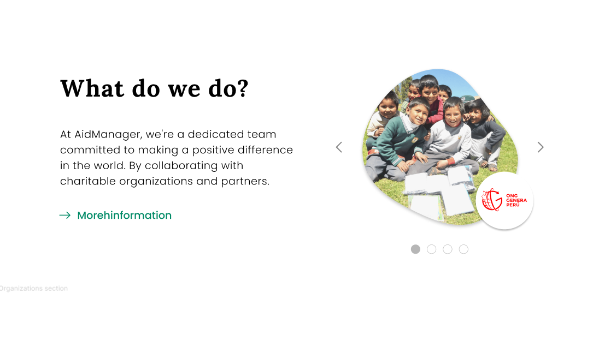

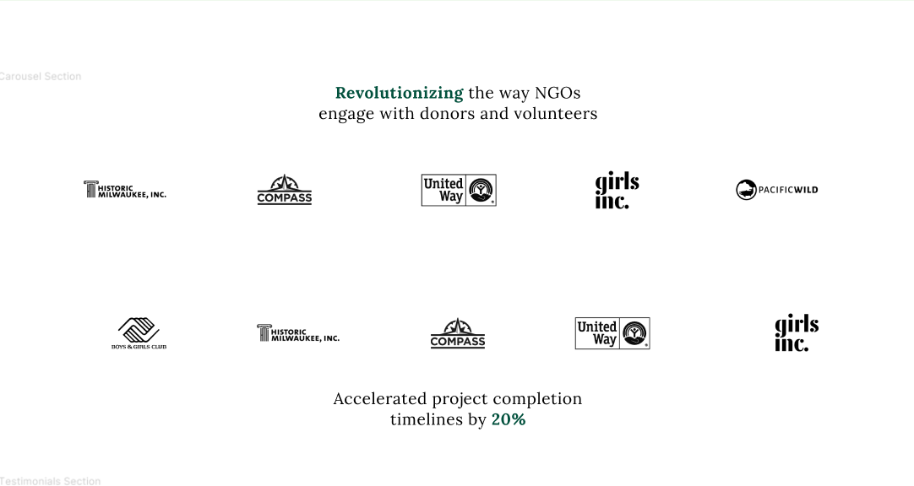

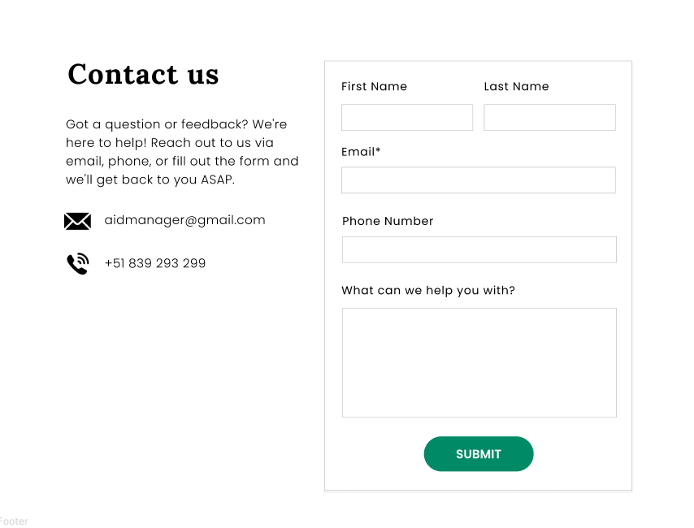
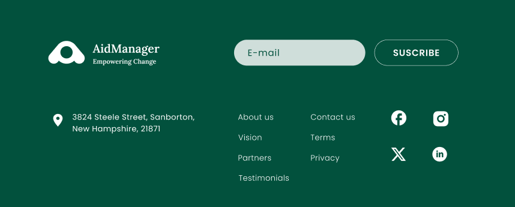

## 4.4.	Mobile Applications UX/UI Design
Aquí nos enfocamos en mostrar el diseño de nuestra solución móvil.
#### 4.4.1.	Mobile Application Wireframe
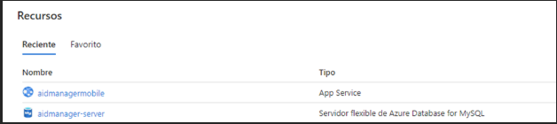
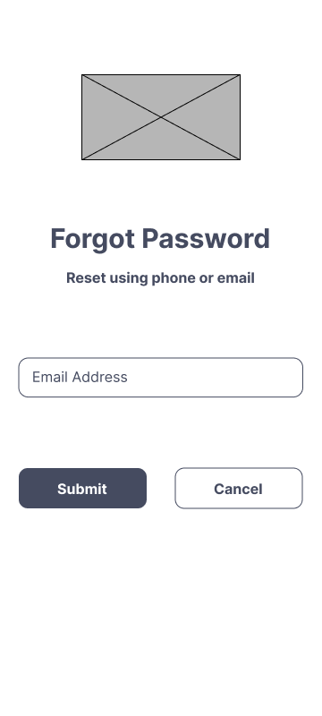

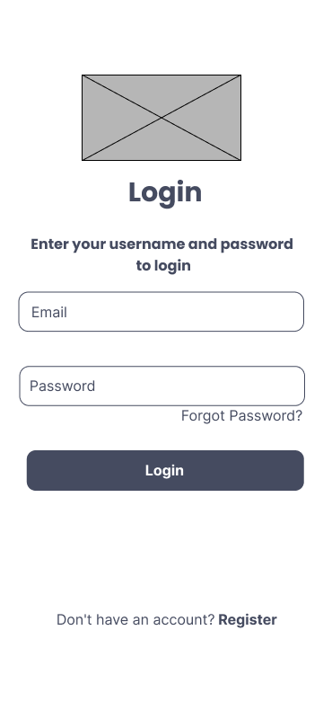
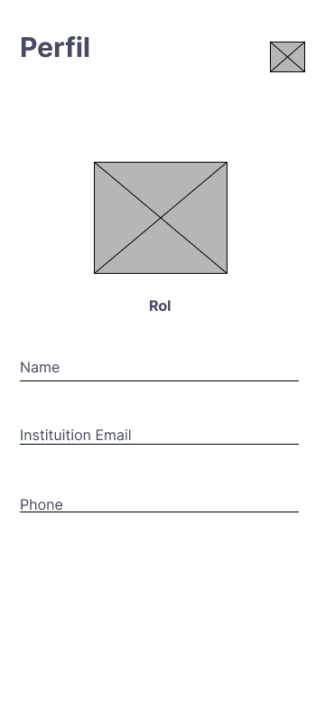

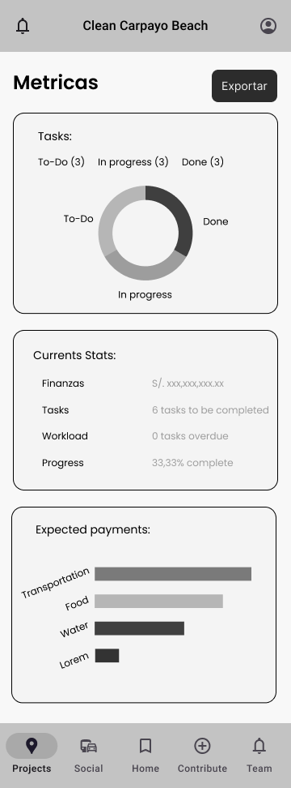

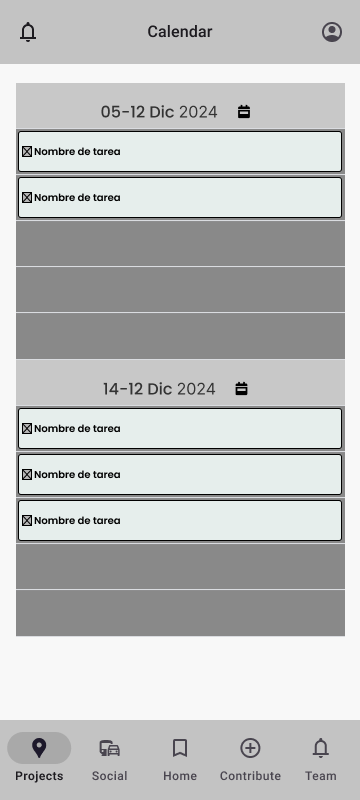
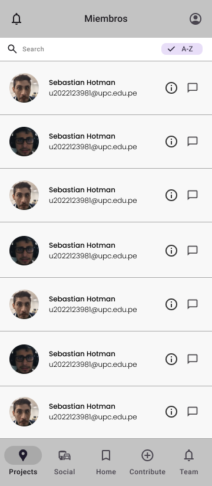

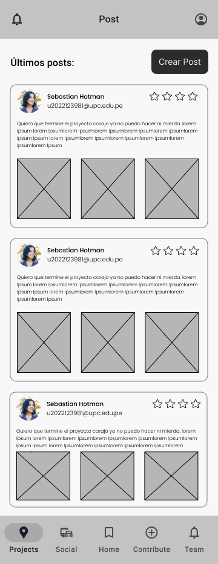

### 4.4.2.	Mobile Application Wireflow Diagram

Gestor de Proyectos necesita ver el listado de proyectos y las tareas asignadas a estos. 

Como Gestor quiero recibir notificaciones sobre nuevos proyectos o actualizaciones de los existentes 

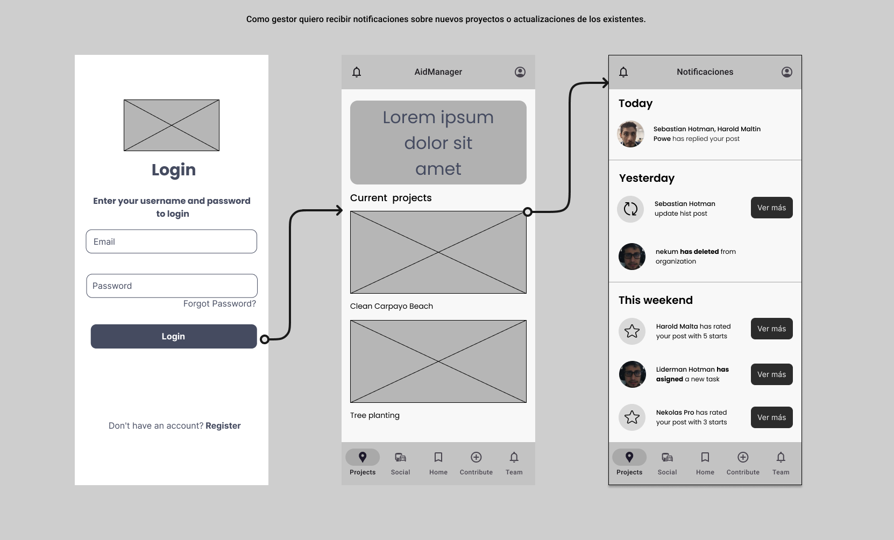
Gestor Crea un nuevo proyecto asignado a las tareas a los integrantes 

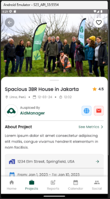
Como gestor de proyectos deseo revisar la información del trabajo realizado y exportar la información. 

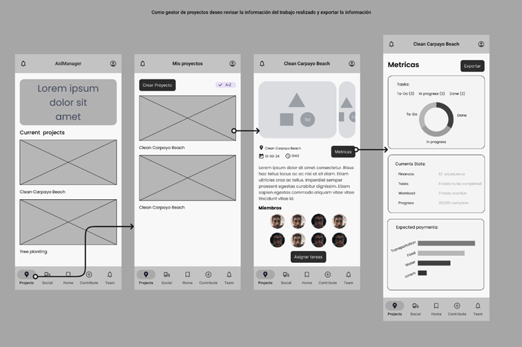

Como gestor de proyecto deseo agregar un post para mi equipo pueda ver y reaccionar 

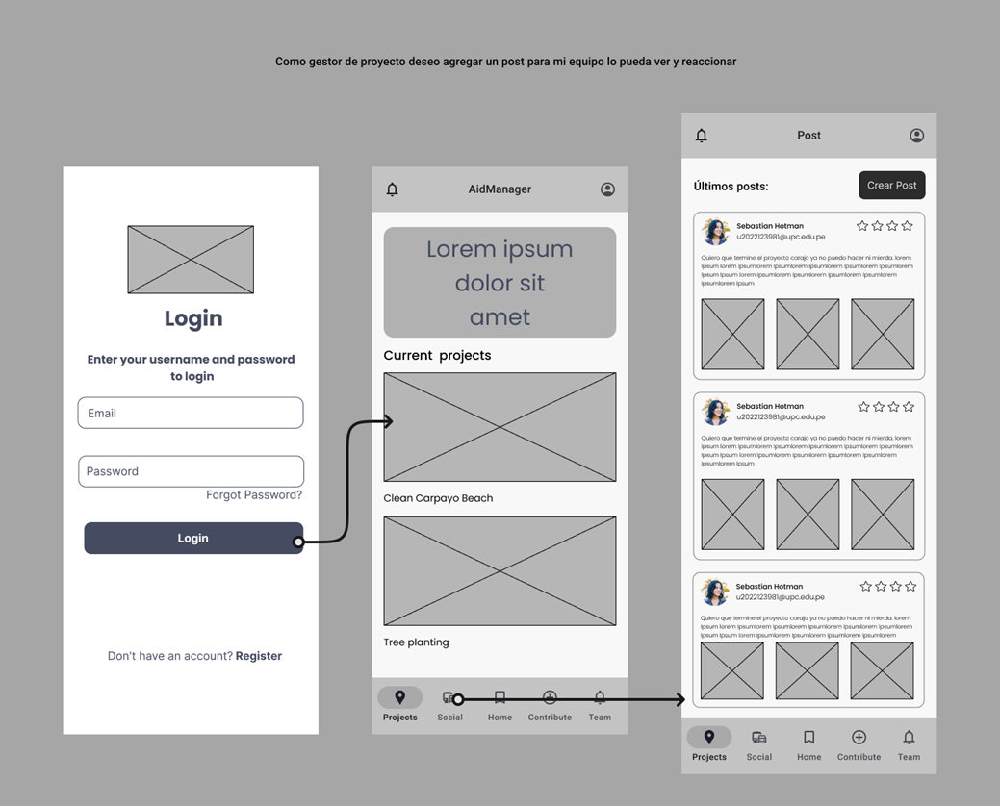
Como miembro de equipo deseo ver las tareas asignadas y las métricas del grupo. 

### 4.4.3.	Mobile Application Mock-ups

### 4.4.4.	Mobile Application Userflow Diagram

## 4.7.	Mobile Application Prototyping
Para poder elaborar los prototipos de la interfaz de usuario destinados a Móvil se siguieron una serie de criterios fundamentales, entre ellos:
Claridad y Facilidad: El enfoque fue lograr que la navegación en la aplicación sea intuitiva y comprensible, con el objetivo de que los usuarios puedan comprender plenamente las funciones de la aplicación. Visualización de reportes estadísticos.
Diseño Responsive: Se ha tenido en cuenta la importancia del diseño para garantizar que la aplicación web sea compatible con una variedad tamaños de pantalla, de tal manera que los usuarios no se vean limitados por el dispositivo que utilicen.
Priorización de Información Relevante: El diseño de la aplicación se enfoca en mostrar únicamente la información más importante para los usuarios pertenecientes al segmento objetivo.

## 4.8.	Domain-Driven Software Architecture
### 4.8.1.	Software Architecture Context Level Diagram

### 4.8.2.	Software Architecture Container Level Diagram

### 4.8.3.	Software Architecture Components Diagram

## 4.9.	Software Object-Oriented Design
### 4.9.1.	Class Diagrams

### 4.9.2.	Class Dictionary
Se muestran las clases que son relevantes.
User - La clase User representa una cuenta de Organización refiriéndose a el gestor y el miembro de equipo y los métodos más importantes de estos.

Project Manager - La clase representa los Project managers

Assistant - la clase representa a los asistentes de eventos y proyectos

Project – la clase Project representa

## 4.10.	Database Diagram

## 4.10.	Relational/Non-Relational Database Diagram

# Capítulo V: Product Implementation

## 5.1 Software Configuration Management
### 5.1.1. Software Development Environment Configuration
Figma:
Es una herramienta visual, donde diseñamos el prototipo de la página web. Se usó para crear los Wireframes, Mock-ups, así como los desktop and Mobile Application del proyecto.
Product UX/UI Design: Producto: Figma Propósito: Para llevar a cabo el diseño de la aplicación, como Wireframes y Mockups, utilizamos Figma. Esta es una plataforma de edición gráfica y diseño de interfaces, utilizada por diseñadores UX/UI.
Enlace:
Software Deployment: Producto: Utilizar Vercel para el despliegue del landing Page. Enlace:
### 5.1.2. Source Code Management
A continuación, se detalla la gestión del código fuente que se implementará en este proyecto, la cual facilitará el seguimiento y control de los cambios y adaptaciones realizados por los miembros del equipo durante el desarrollo. Además, se establecerá un repositorio en GitHub para administrar de manera eficiente las distintas versiones del código.
Repositorio en GitHub para el Landing Page:
Enlace del Landing Page:
Repositorio en GitHub para el Product Implementation:
Desarrollo de GitFlow: Para el desarrollo de este proyecto utilizaremos GitFlow como Workflow que controlará las versiones. Esto nos permitirá la creación de las ramas principales y las ramas de apoyo.
Ramas principales:
Rama Main: Esta rama es la principal en Git, ya que contendrá el código fuente del proyecto que estará listo para ser utilizado.
Rama Develop: Esta rama será la encargada de almacenar el código fuente de los cambios más recientes antes de ser actualizado por una nueva versión del proyecto.
Rama Feature: Esta rama se origina a partir de la rama "Develop" y se destinará al desarrollo de nuevas funciones o características. Una de las ventajas inherentes a su empleo radica en la posibilidad de someter a pruebas las nuevas funcionalidades antes de su incorporación a la rama principal "Develop". Una vez que la rama "Feature" haya sido implementada, se procederá a su eliminación.
Ramas de apoyo:
Rama Release: Esta rama surge de la rama “Develop” y se utiliza para la preparación de una nueva versión del proyecto. En esta rama se realizarán tareas como la detección y solución de errores, sin embargo, no se podrá realizar la implementación de nuevas funcionalidades. Después de haber culminado, se deberá fusionar con la rama "Main" y “Develop”.
Rama Hotfix: Esta rama se origina a partir de la rama "Main" y se emplea con el propósito de abordar y resolver los problemas detectados durante el proceso de depuración del código fuente en la rama Master. Una vez que se hayan resuelto los problemas, será necesario llevar a cabo la fusión con las ramas "Main" y "Develop".
### 5.1.3. Source Code Style Guide & Conventions
Para el desarrollo del código en HTML y CSS se decidió seguir la convención de Google HTML/CSS Style Guide. Entre las más importantes destacan:
El tipo de documento debe especificarse al principio del archivo mediante el uso de meta tags. El elemento <title> debe estar dentro de las etiquetas <head>. 
La sangría debe tener dos espacios. Debe utilizar letras minúsculas para elementos HTML, atributos, propiedades, valores y selectores de CSS. Los atributos de los elementos HTML deben estar entre comillas. 
Cada elemento HTML debe tener su correspondiente etiqueta de cierre. Se recomienda evitar largas líneas de código. Es importante indicar el ancho y alto de las imágenes, así como el texto alternativo (alt). 
Para el código JavaScript, seguimos la convención de la Guía de estilo Java de Google de terminar cada línea con un punto y coma, usar Camelcase para variables y funciones y encerrar valores de cadena entre comillas simples.
Java sigue el estándar Google Java Style Guid, que determina el formato de los nombres de paquetes, clases y métodos, la sangría de la tabla, la división de líneas largas y los nombres de archivos Java que coinciden con el nombre de la clase. contenida en el mismo. Se recomienda insertar un salto de línea después de cada declaración.
### 5.1.4. Software Deployment Configuration
Este apartado describe el proceso de configuración y despliegue del software, utilizando las herramientas principales que hemos integrado en nuestro flujo de trabajo: GitHub para el control de versiones.
GitHub - Control de Versiones y Flujo de Trabajo: GitHub es la herramienta central para el control de versiones y la gestión del código en el proyecto. Utilizamos el enfoque de branching basado en GitFlow para garantizar un ciclo de desarrollo ordenado y controlado.
Vercel: Vercel es una plataforma en la nube que permite a los desarrolladores crear, implementar, desplegar y escalar aplicaciones de manera rápida y sencilla. En Vercel, es posible desplegar sitios web estáticos que no requieren interacciones complejas con el usuario ni actualizaciones frecuentes de contenido.

## 5.2. Software Implementation & Deployment
### 5.2.1. Sprint Backlogs

### 5.2.2. Implemented Landing Page Evidence

### 5.2.3. Implemented Frontend-Web Application Evidence

### 5.2.4. Implemented Native-Mobile Application Evidence

### 5.2.5. Implemented RESTful API and/or Serverless Backend Evidence

### 5.2.6. RESTful API documentation

### 5.2.7. Team Collaboration Insights

## 5.3. Video About-the-Product
Link: https://youtu.be/5C6CFJQ90q8

# Conclusiones
En conclusión, para la TB1 se realizó una investigación respecto a nuestra propuesta, utilizando el proceso UX logramos plantear Assumptions para el proyecto y asimismo realizamos las herramientas de UXPressia para realizar nuestro NeedFinding. Gracias a estos procesos logramos identificar nuestras historias de usuario.
No obstante, siguiendo la metodología ágil esperamos realizar cambios pequeños según sea necesario en los procesos de desarrollo.
En conclusión, para la TB2 se realizó el proceso de diseño tanto para la aplicación móvil como para el back end de esta, adicionalmente se realizaron las correcciones de la entrega anterior según menciono el profesor específicamente con las historias de usuario, el Product Backlog y los Hypotesis Statements.
En conclusión, para el TP se realizó el deployment del back-end y las primeras secciones de nuestra aplicación móvil. Se toma en alta consideración el diseño de figma y diagramas de base de datos. Asimismo, buscamos documentar extensivamente los
Aun así, el equipo continúa presentando mejoras en la organización a base de los errores que se cometen siempre buscando un feedback para mejorar.
En conclusión, para el TB3 se han realizado mejoras a la aplicación móvil y asimismo al back end haciendo uso de mejores prácticas y funciones más de acuerdo al diseño realizado. Se presentan mejoras en los formatos del informe y organización.
En conclusión, para la TB4 hemos continuado el desarrollo a la aplicación móvil continuando la implementación de los ítems del backlog, mejorando la conexión con el back end y concluyendo con la gran mayoría de funciones, asimismo hemos realizado entrevistas de validación para una demo funcional de la aplicación y analizamos nuestras heuristicas.
# Objetivos Smart
Harold Mayta:	
	Después de graduarme como Ingeniero de Software, mi meta es establecer, en un plazo de año y medio, mi propio negocio de desarrollo de software en el extranjero. Este emprendimiento estará enfocado en crear soluciones tecnológicas innovadoras para clientes internacionales, utilizando Angular como framework principal para el frontend, Docker para optimizar la implementación de aplicaciones, y siguiendo la metodología ágil Scrum para garantizar una gestión eficiente y colaborativa en los proyectos.
Para lograrlo, en los primeros seis meses tras mi graduación, me comprometeré a perfeccionar mis habilidades mediante cursos avanzados en Angular y certificaciones en DevOps y Scrum, lo que me permitirá ofrecer servicios de alta calidad desde el inicio. Además, trabajaré activamente en construir una red profesional sólida que me ayude a obtener al menos tres contratos importantes en el primer año de operaciones. Mi visión a largo plazo es que este negocio no solo sea rentable, sino también un espacio donde pueda fomentar la innovación y colaborar con equipos talentosos de distintas partes del mundo.

Barrionuevo Reto, Jean Franco Jo:	
	Después de graduarme como Ingeniero de Software, mi objetivo es fundar, en un plazo de dos años, un a consultora tecnológica en América Latina especializada en inteligencia artificial y desarrollo móvil. Utilizaré Flutter para aplicaciones multiplataforma y TensorFlow para implementar soluciones de IA, enfocándome en apoyar a pequeñas y medianas empresas en su transformación digital.

Para lograrlo, me certificaré en Flutter y Machine Learning durante el primer año, complementándolo con experiencia freelance y asistencia a eventos tecnológicos para construir una red de contactos y un portafolio sólido. Mi visión es liderar una consultora que promueva la innovación y adopción tecnológica en sectores clave como la educación y la salud.

Manuel Peña Rivera:
Tras obtener mi título como Ingeniero de Software, mi meta es desarrollar, en un periodo de tres años, una plataforma educativa en línea que cuente con inteligencia artificial para optimizar el aprendizaje en las habilidades tecnológicas en jóvenes peruanos de entre 15 y 25 años. Este proyecto integrará tecnologías como Vue para el Front-end, Python para el desarrollo de la inteligencia artificial y Azure para la infraestructura en la nube, asegurando escalabilidad y rendimiento.
Para lograrlo, en el primer año me certificaré en AWS, realizaré cursos de UX y desarrollaré un prototipo funcional. Posteriormente, buscaré financiamiento y alianzas estratégicas para consolidar la plataforma y su impacto educativo.

Sebastián Ramírez Hoffmann:
Mi objetivo profesional para los próximos dos años es fortalecer mis habilidades en desarrollo back-end y ciberseguridad, logrando certificaciones clave como CompTIA Security+ o Certified Ethical Hacker (CEH), y en tecnologías de back-end como Node.js, Django o Spring. Planeo desarrollar un proyecto práctico que integre medidas avanzadas de seguridad en un sistema web, participando también en proyectos colaborativos que utilicen metodologías ágiles. Además, asistiré a tres conferencias o meetups en estas áreas y construiré una red de contactos con al menos 10 profesionales del sector. Dedicaré al menos 10 horas semanales a cursos, lectura y práctica para consolidar mi perfil profesional y alinearlo con las demandas del mercado.

Nicolás Esteban:
Después de graduarme como Ingeniero de Software, mi meta es establecerme como desarrollador web especializado en frontend y, posteriormente, expandir mis habilidades hacia el desarrollo móvil. En un plazo de año y medio, planeo construir un negocio de desarrollo de software en el extranjero, enfocado en ofrecer soluciones tecnológicas innovadoras a clientes internacionales. Inicialmente, mi enfoque estará en proyectos freelance que me permitan colaborar en equipos diversos y fortalecer mi experiencia profesional.​

En el ámbito web, priorizaré el uso de tecnologías como React.js, Vue.js, y Angular para crear interfaces modernas, escalables y optimizadas. Más adelante, migraré hacia el desarrollo móvil utilizando frameworks como React Native y otras tecnologías emergentes para ampliar el alcance de mis servicios y adaptarme a las demandas del mercado.​

Durante los primeros seis meses después de mi graduación, me comprometeré a perfeccionar mis habilidades mediante cursos avanzados en desarrollo frontend, así como certificaciones en DevOps y Scrum, lo que me permitirá aplicar buenas prácticas en la entrega de proyectos. Además, trabajaré en construir una red profesional sólida para asegurar al menos tres contratos importantes en mi primer año como freelance.​

Mi visión a largo plazo es consolidar un negocio que sea rentable y que también sirva como un espacio para la innovación y la colaboración, uniendo talento global en la creación de proyectos que transformen la experiencia de los usuarios y contribuyan al avance tecnológico
# Bibliografia
Moya, M. G. (2023b, abril 24). El desafío de las ONG en la gestión organizacional y de proyectos.
Nonprofits, D. F. (2023, 7 agosto). Data Analytics for Nonprofits.
        ()
Everyone Thrives Consultant Services. (2023, 15 diciembre). Data: The Key to 
        Unlocking Nonprofit Success.
Frattaroli, V., Le Goaer, O., & Philippot, O. (2023). Ecological impact of native versus cross-platform mobile apps: A preliminary study. Proceedings of the 2023 38th IEEE/ACM International Conference on Automated Software Engineering Workshops (ASEW), 3-8.
Pai, A. A., Kumar, P. R., Thomas, S., & Pratiba, D. (2023). NGO Connect: Technology for non-profit organisation management. In Proceedings of the 2023 IEEE Conference on Software and Information Technology Systems for Sustainability (pp. 1-6). IEEE.
Gowri, S., Pappa, C. K., Tamilvizhi, T., Nelson, L., & Surendran, R. (2023). Intelligent analysis on frameworks for mobile app development. En Proceedings of the 5th International Conference on Smart Systems and Inventive Technology (ICSSIT 2023) (pp. 1506-1512). Tirunelveli, India: IEEE.

Katti, V. S., & Sowmya, K. (2022). Flutter: Cross-platform IDE for mobile applications. En Proceedings of the 13th International Conference on Advances in Computing, Control, and Telecommunication Technologies (ACT 2022) (Vol. 8, pp. 468-472). IEEE.

# Anexos

[1.1 LeanUX Canvas]:
[Backend Repositorio]

## Imágenes del documento

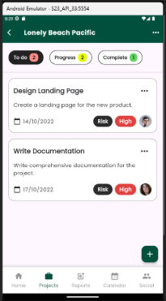

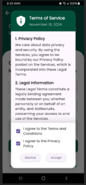

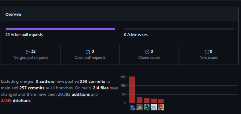

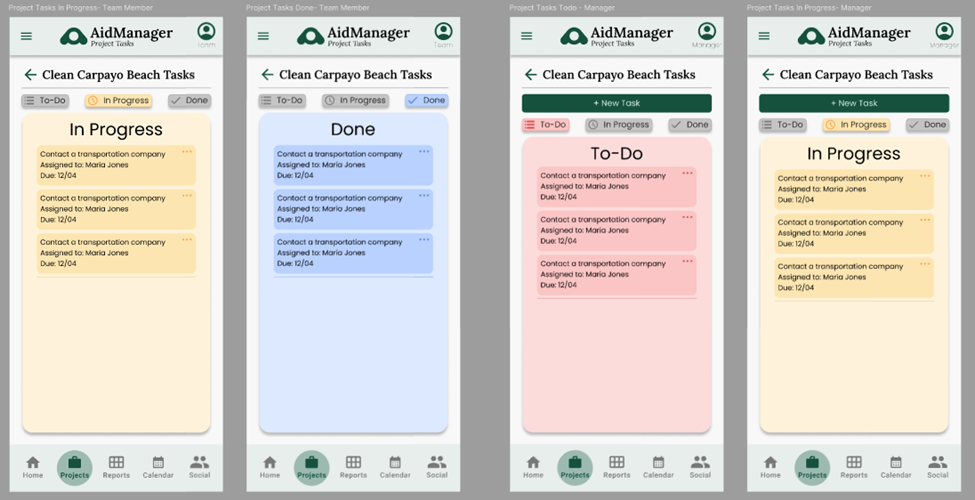

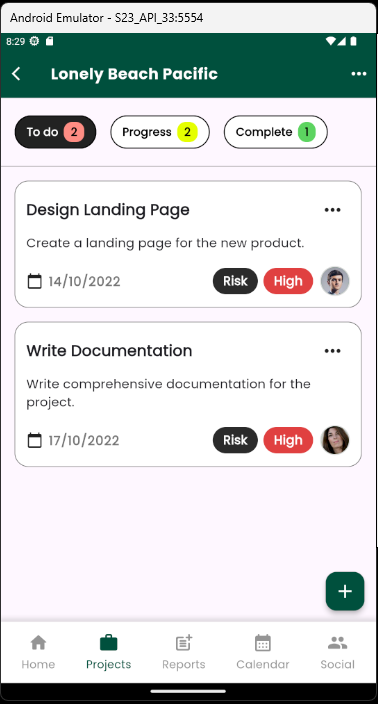

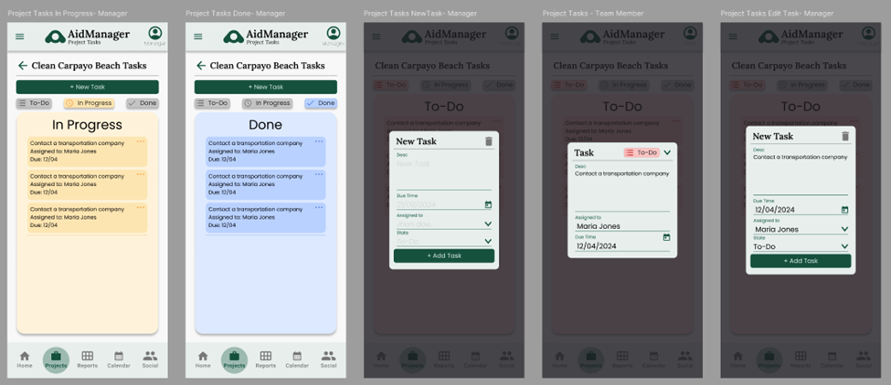

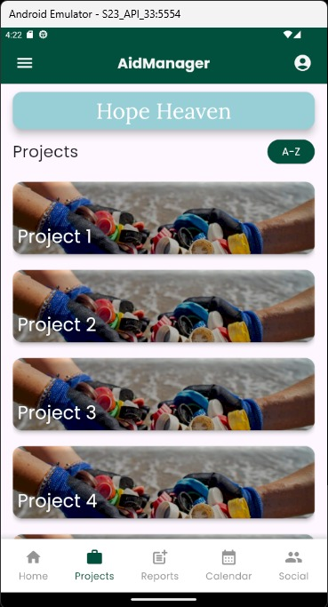

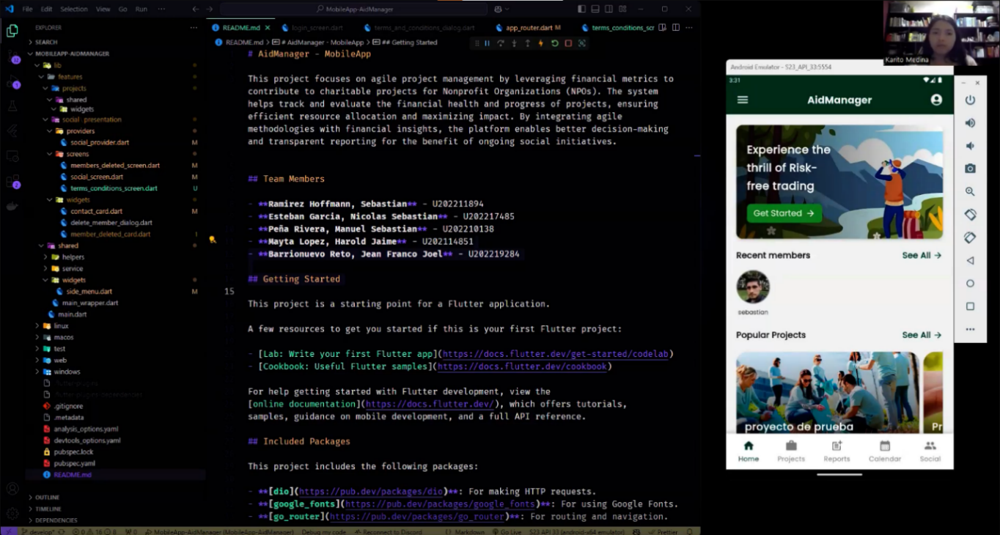

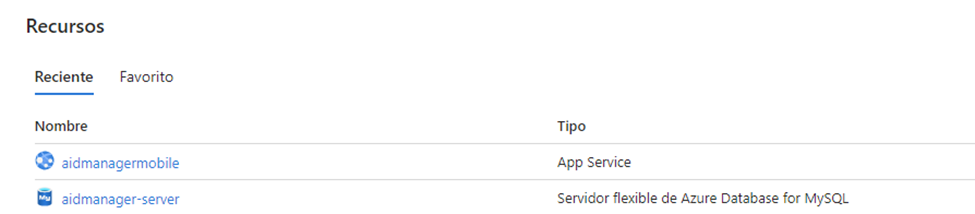

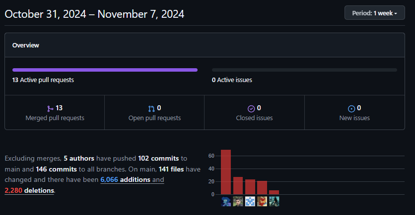

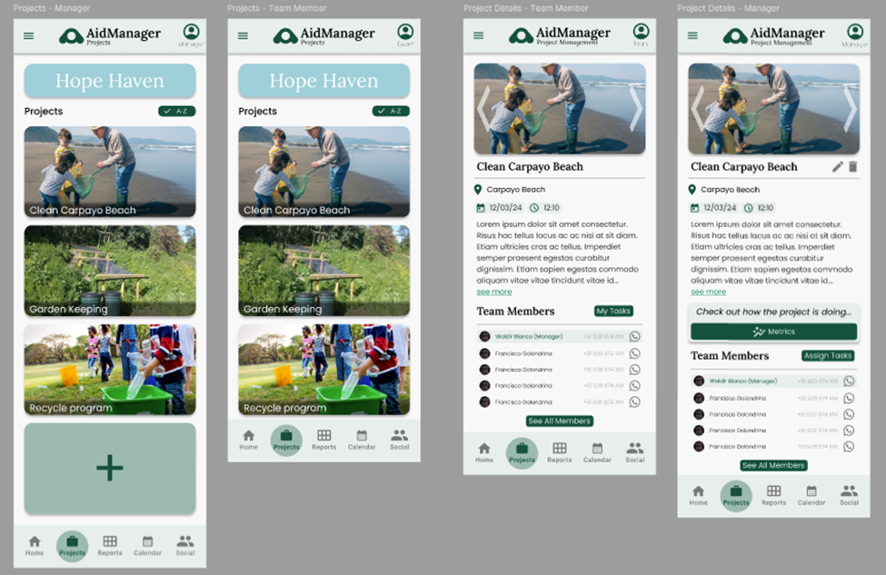

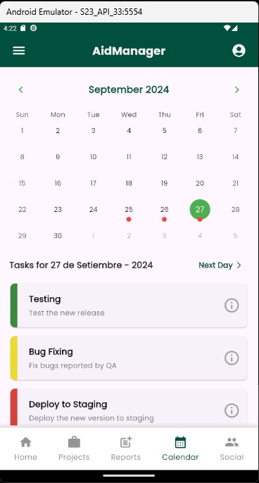

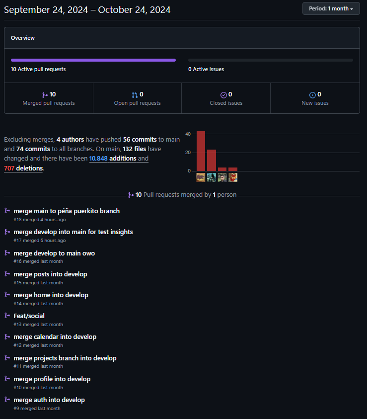

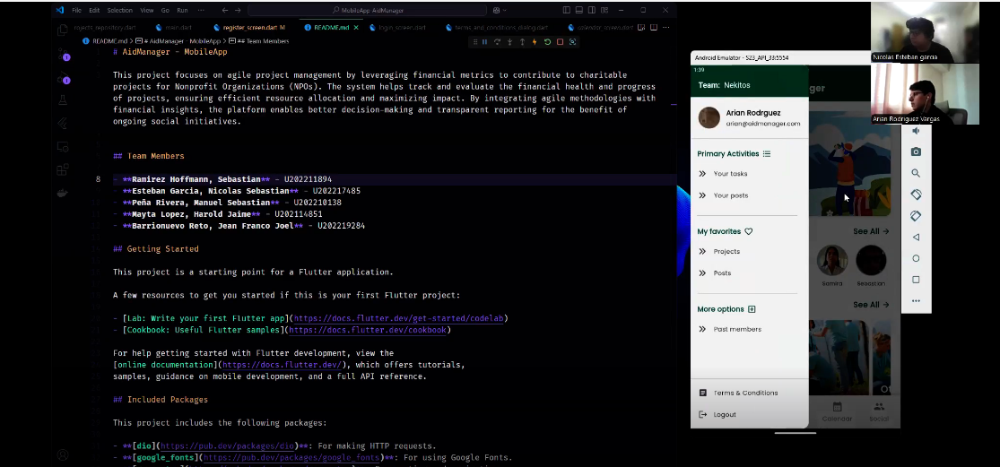

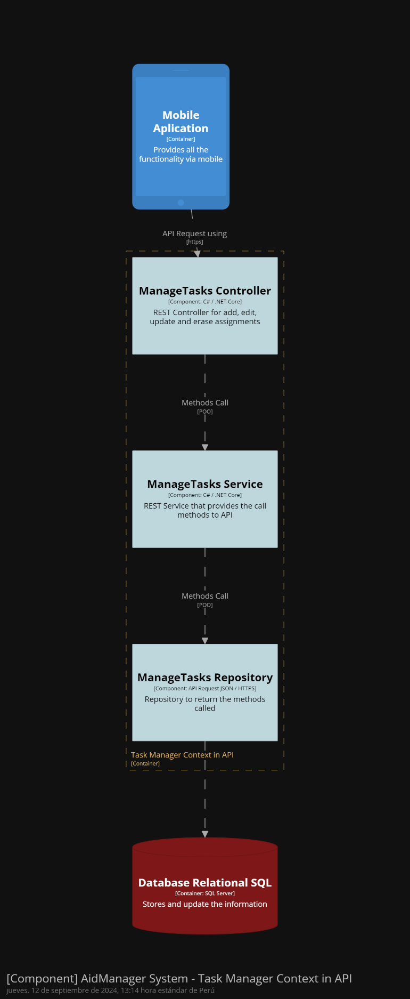

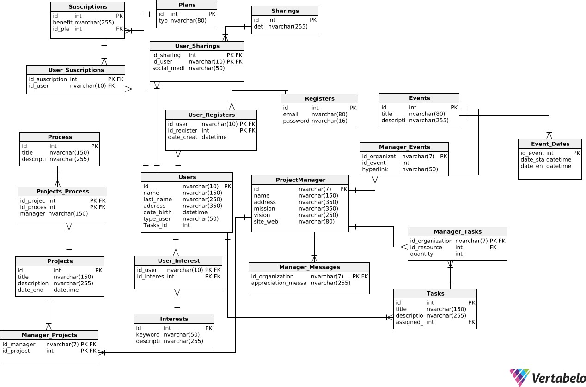

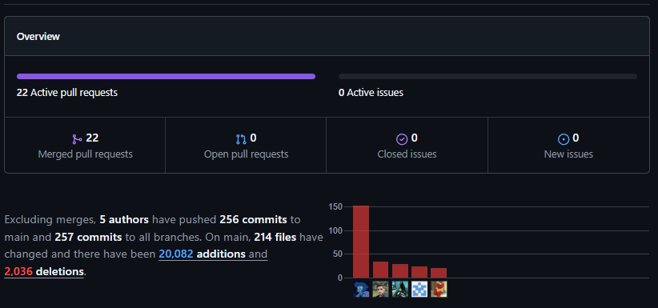

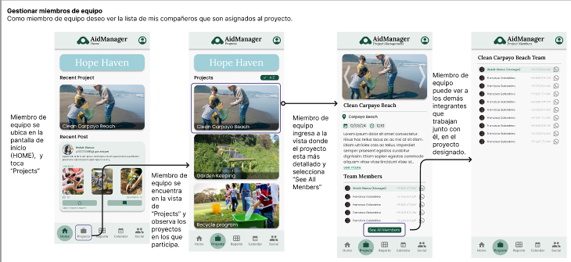

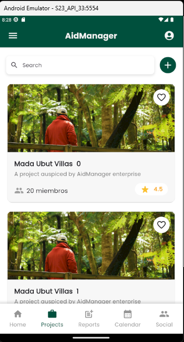

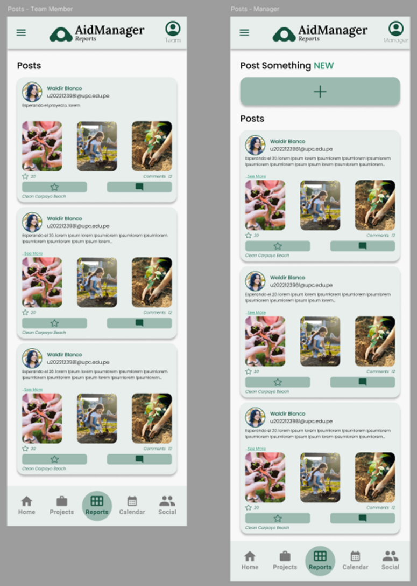

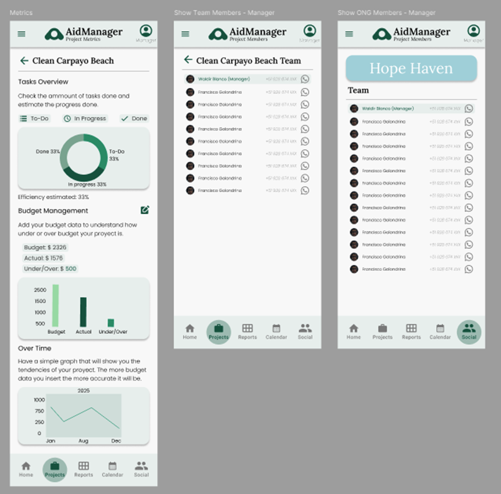

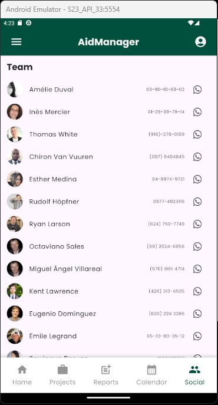

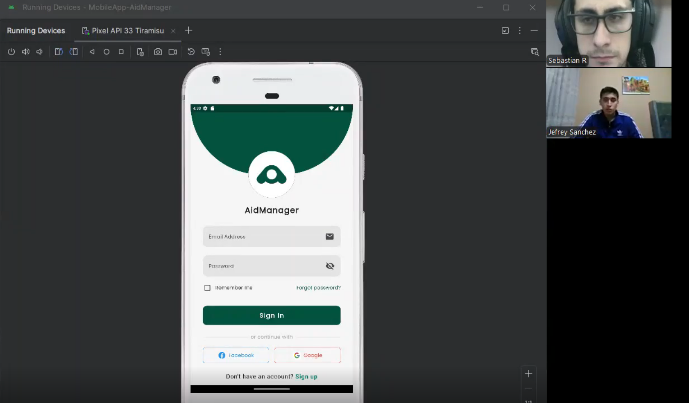


